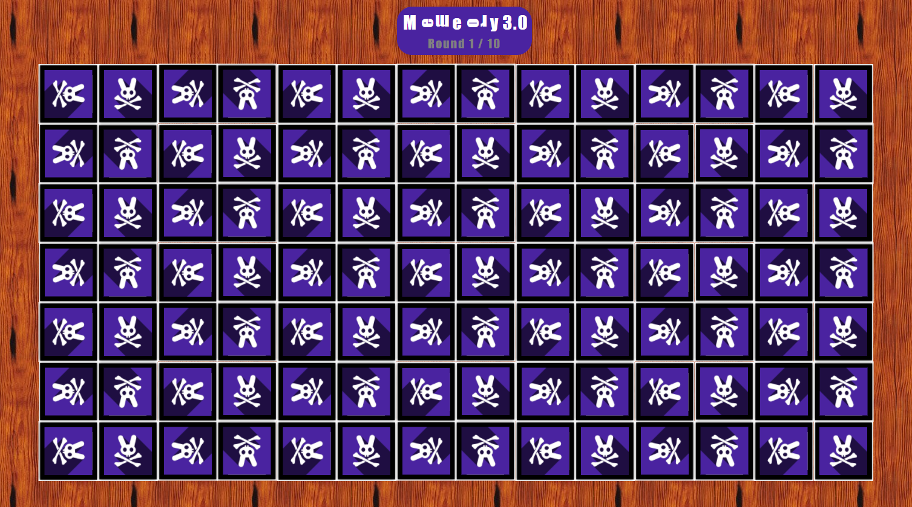

# Memeory 3.0 - The Finale
We finally fixed Memeory 2.0 and proudly release Memeory 3.0 aka the supersecure-Memeory.

Flagbounty for everyone who can solve 10 successive rounds. Time per round is 30 seconds and only 3 missclicks are allowed.

http://46.101.107.117:2107

---



No way to solve this by hand.

I was able to reuse most of the code from
[Memeory 2.0](../../../HackyEaster2019/ch11/README.md).

I just had to update the solving algorithm to cope with
rotated images and different contrast.

At first, I had issues reading the images in Java, but this lib fixed it:
```
<dependency>
    <groupId>com.twelvemonkeys.imageio</groupId>
    <artifactId>imageio-jpeg</artifactId>
    <version>3.6.4</version>
</dependency>
```

The lib also comes with some nice options for image manipulation.

Here is the source code:

```kotlin
private const val BASE_URL = "http://46.101.107.117:2107"

fun main() {
    MemeoryHttpClient(BASE_URL).use { client ->
        client.obtainSession()

        for (i in 1..10) {
            println("Starting round $i")
            playOneRound(client)
        }
    }
}

class Card(val id: Int, val image: BufferedImage)

private fun playOneRound(client: MemeoryHttpClient) {
    val cardsPath = client.downloadAllCardImages()

    val cards = Files.list(cardsPath).asSequence()
        .sortedBy { cardPath -> Files.size(cardPath) } // Easy optimization
        .map { cardPath ->
            Card(
                cardPath.fileName.toString().removeSuffix(".jpg").toInt(),
                ImageIO.read(cardPath.toFile())
            )
        }
        .toMutableList()

    // Solve the round
    while (cards.isNotEmpty()) {
        if (cards.size == 2) {
            println("Playing last move")
            client.playOneMove(Pair(cards[0].id, cards[1].id))
            cards.clear()
            break
        }

        val card = cards.removeAt(0)
        println("Searching match for ${card.id}")
        val matchingCard = findMatchingCard(card, cards)

        if (matchingCard != null) {
            client.playOneMove(Pair(card.id, matchingCard.id))
            cards.remove(matchingCard)
        } else {
            println("Damn, no match found for ${card.id}")
            cards.add(card)
        }
    }
}

private fun findMatchingCard(card: Card, cards: MutableList<Card>): Card? {
    for (other in cards) {
        val rots = createRotations(other.image)
        for (rot in rots) {
            if (diffImages(card.image, rot) < 14) {
                println("Pair found: ${card.id}+${other.id} (diff: ${diffImages(card.image, rot)})")
                return other
            }
        }
    }
    return null
}

private fun createRotations(img: BufferedImage): List<BufferedImage> {
    val img90CW = ImageUtil.createRotated(img, ImageUtil.ROTATE_90_CW)
    val img180 = ImageUtil.createRotated(img, ImageUtil.ROTATE_180)
    val img270CCW = ImageUtil.createRotated(img, ImageUtil.ROTATE_90_CCW)
    return listOf(img, img90CW, img180, img270CCW)
}

private fun diffImages(img1: BufferedImage, img2: BufferedImage): Double {
    val width = img1.width
    val height = img1.height
    val width2 = img2.width
    val height2 = img2.height

    if (width != width2 || height != height2) {
        return 100.0
    }

    var diff: Long = 0
    for (y in 0 until height) {
        for (x in 0 until width) {
            diff += diffPixels(img1.getRGB(x, y), img2.getRGB(x, y)).toLong()
        }
    }
    val maxDiff = 3L * 255 * width * height
    return 100.0 * diff / maxDiff
}

private fun diffPixels(rgb1: Int, rgb2: Int): Int {
    val r1 = rgb1 shr 16 and 0xff
    val r2 = rgb2 shr 16 and 0xff
    val g1 = rgb1 shr 8 and 0xff
    val g2 = rgb2 shr 8 and 0xff
    val b1 = rgb1 and 0xff
    val b2 = rgb2 and 0xff
    return abs(r1 - r2) + abs(g1 - g2) + abs(b1 - b2)
}
```

Output snippet:
```
Searching match for 80
Pair found: 80+37 (diff: 8.669709150326797)
Play (80, 37): 200 ok

Searching match for 21
Pair found: 21+27 (diff: 11.248558823529411)
Play (21, 27): 200 ok

Searching match for 14
Pair found: 14+47 (diff: 0.0)
Play (14, 47): 200 ok

Playing last move

Play (5, 79): 200 ok, here is your flag: he2021{0k-1-5u44end3r-y0u-w1n!}
```

The flag is `he2021{0k-1-5u44end3r-y0u-w1n!}`