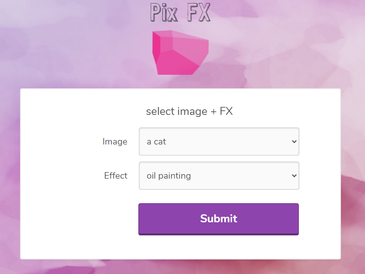
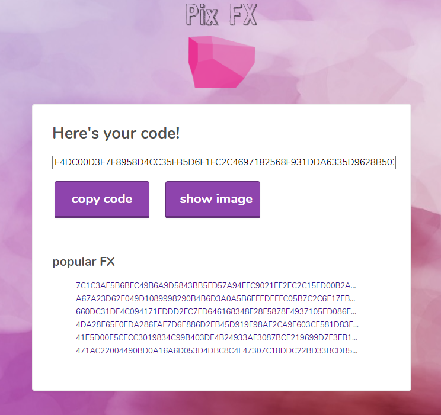
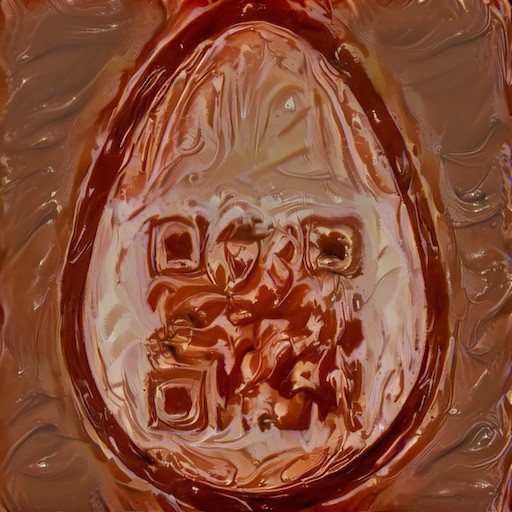
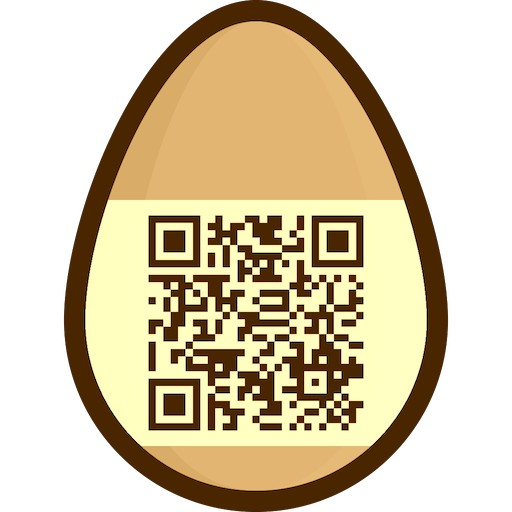

# Pix FX
Hey there! We have our fancy new Pix FX service online!

Try it out!

http://46.101.107.117:2110

---

## Description



Submitting the form returns a similar code:
```
28CEA35762D93617580F0C445BEB71D2F1BE27244F934E3314AC0D8BB776FA3BFF88D87D78205839D04F7CE96CCFDBCD54DFFB91E9CD6ADBD3E5AC222D4F710D
```



The code serves for retrieving the selected image and effect.
In this example _a cat_ + _oil painting_:


## Analysis
- the **code is always different**, even for the same combinations of the image and effect
- the **code length is 48 or 64 bytes**
- one of popular FX codes is`41E5D00E5CECC3019834C99B403DE4B24933AF3087BCE219699D7E3EB178A06F7B4717A36C617760EC0AD8BFD5DF05B2`
  and it points to the egg:
  


I was able to get different error messages when I started manipulating the code:
- `Decryption Error`
- `Parse error`
- `Error processing image null` for arbitrary 16 bytes message

Lastly, some images has a bit weird names - _chaining_ and also _Flipper_.

Carefully evaluating all the information, I was able to guess what's this is about:

> The code is **AES encrypted** (block cipher with a random IV is a perfect fit).
> AES is in **CBC mode** (the image named _chaining_ is a hint).

## Solution

Now, how we get the egg with a readable QR code? The idea is: **manipulate**
(using a technique called [bit flipping](https://crypto.stackexchange.com/questions/66085/bit-flipping-attack-on-cbc-mode)) **the code
to get the egg image with sepia effect** (that's the only effect which doesn't break the QR code).

To be able to manipulate the correct bytes, I needed to guess the plain text. I wrote a small script
to fuzz the egg's code:
```kotlin
private const val EGG =
    "41E5D00E5CECC3019834C99B403DE4B24933AF3087BCE219699D7E3EB178A06F7B4717A36C617760EC0AD8BFD5DF05B2"

// Fuzz the egg code
fun main() {
    val httpClient = HttpClient.newHttpClient()

    for (i in 0 until 32 step 2) {
        println("Byte position ${i / 2}")
        for (b in listOf("00", "ff")) {
            val code = EGG.substring(0, i) + b + EGG.substring(i + 2)
            println("Sending $code ($b)")
            
            val request = HttpRequest.newBuilder()
                .GET()
                .uri(URI.create("http://46.101.107.117:2110/picture?code=$code")).build()

            val response = httpClient.send(request, HttpResponse.BodyHandlers.ofString()).body()!!
            response.lines().filter { it.contains("<span>") }.forEach { println(it) }
        }
    }
}
```

It outputs:
```
Byte position 0: (41 --> 00)
          <span>Parser Error.</span>
Byte position 1: (E5 --> 00)
          <span>Parser Error.</span>
Byte position 2: (D0 --> 00)
          <span>Unknown field &#39;�mage&#39;</span>
Byte position 3: (0E --> 00)
          <span>Unknown field &#39;icage&#39;</span>
Byte position 4: (5C --> 00)
          <span>Unknown field &#39;im=ge&#39;</span>
Byte position 5: (EC --> 00)
          <span>Unknown field &#39;ima�e&#39;</span>
Byte position 6: (C3 --> 00)
          <span>Unknown field &#39;imag�&#39;</span>
Byte position 7: (01 --> 00)
          <span>Parser Error.</span>
Byte position 8: (98 --> 00)
          <span>Parser Error.</span>
Byte position 9: (34 --> 00)
          <span>Parser Error.</span>
Byte position 10: (C9 --> 00)
          <span>Parser Error.</span>
Byte position 11: (9B --> 00)
          <span>Error processing image �gg</span>
Byte position 12: (40 --> 00)
          <span>Error processing image e&#39;g</span>
Byte position 13: (3D --> 00)
          <span>Error processing image egZ</span>
Byte position 14: (E4 --> 00)
          <span>Parser Error.</span>
Byte position 15: (B2 --> 00)
          <span>Parser Error.</span>
```

Okay, this is good enough to recover the plaintext: `{"image": "egg" `.

Finally, let's craft the exploit. We must use one of the codes for _Tony and Pony_ (image name 
fits into the first encrypted block) and _Sepia effect_ (to preserve the QR code).

Basically, we need to change `{"image": "tony"` into `{"image": "egg" `.

Original code for Tony:
```
EEC938CA92DC0932A048F0 09 94 CA 32 7D B8B500A4B208DE1EDE75F804486C2D76E54BCC4D7358A120438CEFEF5FFF47FA
```

The payload (`09 94 CA 32 7D` xor `tony"` xor `egg" `):
```
EEC938CA92DC0932A048F0 1c 9c c3 69 7f B8B500A4B208DE1EDE75F804486C2D76E54BCC4D7358A120438CEFEF5FFF47FA
```

Bingo!



The flag is `he2021{fl1pp1n_da_b1ts_gr34t_succ355}`