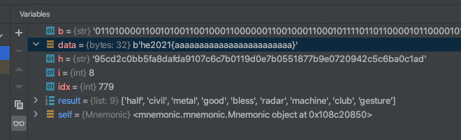

# Finding Mnemo
Dorie has forgotten everything again... Luckily, there is a backup:

```
adapt    3555  
bind     824e  
bless    8fcf  
blind    81db  
civil    03ec  
craft    ed05  
garage   9db4  
good     d2ba  
half     1272   
hip      8d53  
home     21b7  
hotel    1cb0  
lonely   e5b8  
magnet   16b9  
metal    770e  
mushroom dd80  
napkin   0829  
reason   ecd3  
rescue   5ef2  
ring     e3b0  
shift    4ea1  
small    f1f6  
sunset   b271  
tongue   f08d  
```

---

Googling the random looking words, I discovered [BIP 0039](https://en.bitcoin.it/wiki/BIP_0039).

I had to do a bit of reading:
- https://en.bitcoin.it/wiki/Seed_phrase 
- https://medium.com/mycrypto/the-journey-from-mnemonic-phrase-to-address-6c5e86e11e14  
- https://bitcoinbriefly.com/ultimate-guide-to-bitcoin-wallets-seeds-private-keys-public-keys-and-addresses/

I was thinking where the flag could be hidden, and my best guess was in the _original entropy_.

However, the first step is to find a way how to sort the seed phrase. The current state is not even valid:

```python
from mnemonic import Mnemonic

mnemo = Mnemonic("english")

words = ["adapt", "bind", "bless", "blind", "civil", "craft", "garage", "good", "half", "hip", "home", "hotel",
          "lonely", "magnet", "metal", "mushroom", "napkin", "reason", "rescue", "ring", "shift", "small", "sunset",
          "tongue"]

entropy = mnemo.to_entropy(words)
print(entropy)
```

It outputs: `ValueError: Failed checksum.`

Next, I tried reverse engineering to confirm the previous idea.
My thinking was if the flag starts with `he2021{` (7 * 8 bytes = 56 bits), then I should be able to recover the first
5 words in correct order (5 * 11 bits).
I replaced the entropy value (in a debugger) with a dummy flag `he2021{aaaaaaaaaaaaaaaaaaaaaaaa}`:



This is looking good! The first 5 words are indeed present on Dorie's list:
```
half    1272
civil   03ec
metal   770e
good    d2ba
bless   8fcf
```

I had no idea what the second column (with hex numbers) was good for. Luckily, I was able to get
the flag without it.

Here is the idea. We know the first 56 bits of entry (`he2021{`). However, to get our first 5 words,
we need only 55 bits. 1 bit is remaining! Not much, but given there are only 19 words left, the 1 single
bit can eliminate roughly half of them. So, we test all the words (~10) and eliminate those words which produce
non-ascii flags.

There are only 3 valid (ascii) options for the first guess!
Again, some bits will remain unused after the second guess.
This reduces the search space from insane (`19!`) to a very small subset.
I wrote [Mnemo.kt](../../../../src/main/kotlin/cz/vernjan/ctf/he21/Mnemo.kt)
to brute force the search space and check for a valid flag. It spit out 2 possible flags only:
```
he2021{f1sh_r_fr1ends_n0t_f00d!}
[half, civil, metal, good, bless, reason, shift, home, garage, napkin, sunset, tongue, bind, rescue, mushroom, hip, hotel, lonely, blind, small, adapt, craft, magnet, ring]

he2021{ndsh_pt_r1dd1s_n2_ff01f!}
[half, civil, metal, good, bless, rescue, mushroom, home, garage, lonely, blind, tongue, bind, craft, shift, hip, hotel, napkin, sunset, small, adapt, reason, magnet, ring]
```

Obviously, the first one is correct.

The flag is `he2021{f1sh_r_fr1ends_n0t_f00d!}`