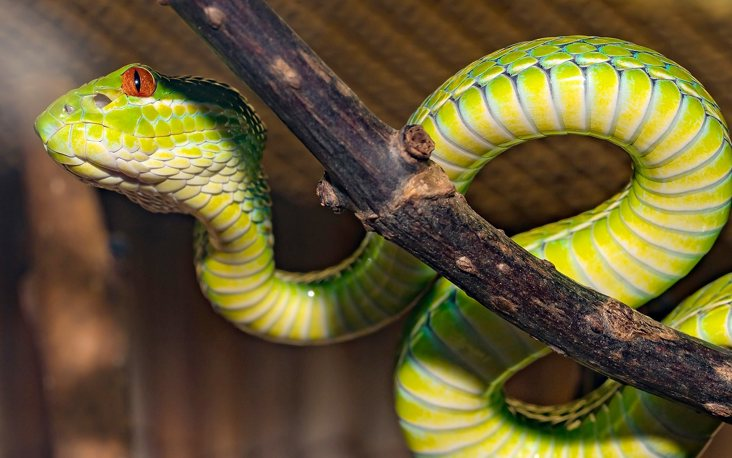
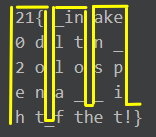

# The Snake
Cunning snake has a little riddle for you:

```
21{_inake0dltn_2olospena__iht_fthet!}
```

---

Hints:
> - It's a self-made algorithm, not one you'll find in the web.
> - Look at the snake in the title image.
 


I like pen & paper cipher like this!

Two observations brought me to a correct solution:
- There are parts which are obviously correct: `21{` and `!}`
- Surely, the flag must start with `he2021{`. Notice the distances between `0`, `2`, `e` and `h`- it's always 5!:
  `21{_inake 0 dltn_ 2 olosp e na__i h t_fthet!}`

The solution is, indeed, a snake:
```
21{ _in ake
0 d l t n _
2 o l o s p
e n a _ _ i
h t_f the t!}
```



Read it from the bottom left corner going up: `he2021{dont_fall_into_the_snake_pit!}`