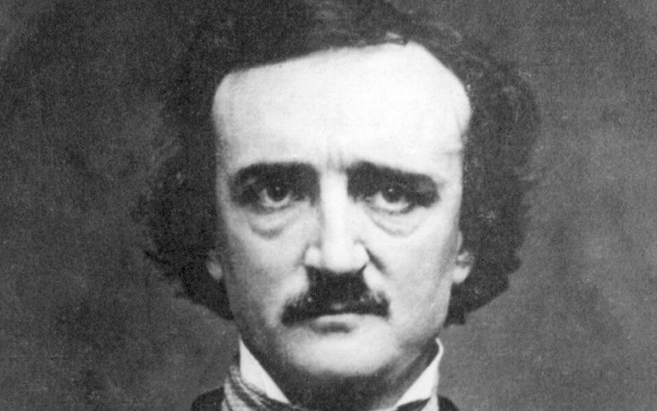

# Teaser Challenge



Ed wrote you a letter containing strange symbols:

```
;85)8( )‡0¶8† -‡*3(5;)
```

Can you recover the message?

---

The person is [Edgar Allan Poe](https://en.wikipedia.org/wiki/Edgar_Allan_Poe).
You can easily google him using [image search](https://www.google.cz/imghp).
He was interested in cryptography and one of his stories is [The Gold-Bug](https://en.wikipedia.org/wiki/The_Gold-Bug).

The story describes a solution for this substitution cipher:

```
a  5
b  2
c  -
d  †
e  8
f  1
g  3
h  4
i  6
j
k
l  0
m  9
n  *
o  ‡
p  .
q
r  (
s  )
t  ;
u  ?
v  ¶
w  
x
y  :
z
```

Decrypted message reads `teaser solved congrats`.