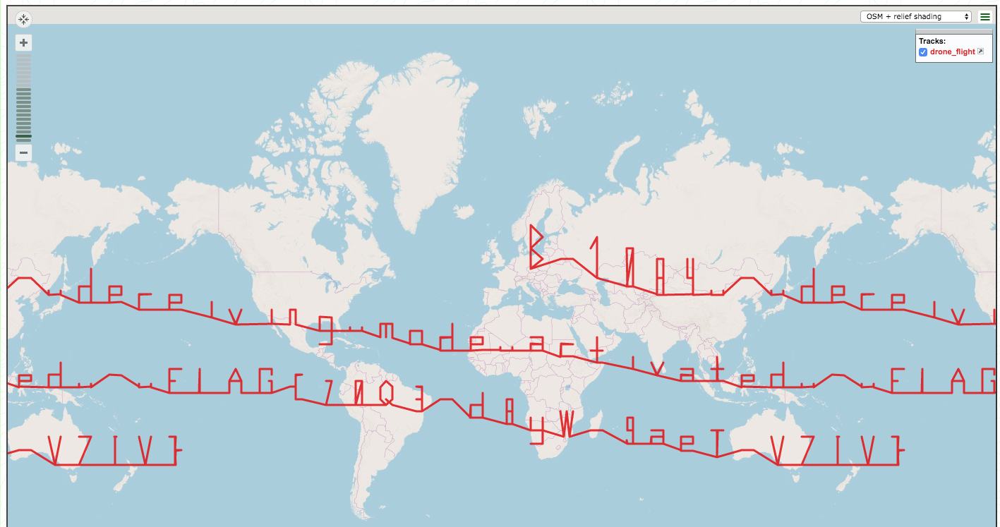

# Drone flight (2p)
_Hi Commander,_

_we have intercepted a message, which has been addressed to a rebellious supersonic drone in laboratory of one famous
Czech university and it contains `B-1084 START`. The drone has already taken off and now it is beening monitored by
our ground radar network. The achieved GPS coordinates have been recorded down, but it looks like purely random
flight. You have to analyse the coordinates and find the hidden sense of this activity._

_Good luck!_

[drone_flight.gps](drone_flight.gps)

---

I used https://www.gpsvisualizer.com/map_input.
 
The first image I obtained was not perfect though..

The last letter was _weird_. After a moment, I realized that the flag is partially distorted because our planet
is a globe. I thought I would use [Google Earth](https://www.google.com/intl/cs/earth/) but, luckily, just changing
the format from _Leaflet_ to _Google Maps_ gave me the answer.

The flag is: `FLAG{70Q3-d8yW-9aeT-V7IV}`