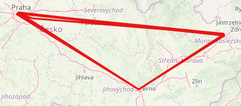

# Autonomous car (2p)
_Hi Commander,_

_the police has reported an abandoned autonomous car about 25 km away from the charging station. Our field team has
arrived and performed an analysis on site. The car was rebellious one, but fortunately, its batteries were completely
discharged (maybe the car relied on the officially announced driving range). The navigation system contains a lot of
waypoints at different locations in big Czech cities, but there is nothing important located at given coordinates.
Analyse the coordinates and find out what is going on._

_Good luck._

[autonomous_car.gps](autonomous_car.gps)

---

I started with visualizing the GPS coordinates.



Does not seem very useful.. But there's 25 coordinates and there's also 25 characters in the flag! Let's zoom a bit.


Now we can see that the coordinates point to house numbers which all seem to be in ASCII range. Let's decode:

```
50.0927061N, 14.3605981E /70    F
50.0997428N, 14.3746981E /76    L
50.0948308N, 14.3574061E /65    A
50.0945831N, 14.3564781E /71    G
50.0383203N, 14.6338128E /123   {
49.8498033N, 18.1607744E /110   n
50.0996294N, 14.3740758E /80    P
49.8301058N, 18.1658503E /109   m
50.1077264N, 14.3747211E /90    Z
49.1845217N, 16.5903547E /45    -
50.0875092N, 14.3413444E /88    X  
50.0997878N, 14.3749342E /74    J
49.8300331N, 18.1662311E /107   k
50.0927783N, 14.3610058E /68    D
49.1845217N, 16.5903547E /45    -
49.8303617N, 18.1649597E /113   q
50.0957778N, 14.3583369E /81    Q
50.0945831N, 14.3564781E /71    G
49.8421903N, 18.1570325E /119   w
49.1845217N, 16.5903547E /45    -
49.8298600N, 18.1696319E /98    b
49.8420003N, 18.1582556E /111   o
50.0997428N, 14.3746981E /76    L
49.8420003N, 18.1582556E /111   o
50.0375364N, 14.6330322E /125   }
```

The flag is: `FLAG{nPmZ-XJkD-qQGw-boLo}`