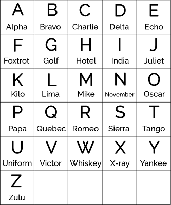

# Ice-cream selling machine (3p)
_Hi Commander,_

_our reconnaissance teams have discovered one of rebellious self-aware machine outside the library and identified it
as smart ice-cream selling machine. It has some technical difficulties (we assume that the machine just has run out
of ice cream) and started to call for help. Our wiretapping team has captured part of one attempt and we are sure
that it contains special rescue code and we want it. Analyse the trafic and acquire the code._

_Good luck!_

[ice-cream_selling_machine.pcap](ice-cream_selling_machine.pcap)

---
First step is obvious - use _Wireshark_ for packet analysis.

I started with exploring the HTTP protocol. I tried to make sense of the codes but it led me nowhere. My futile attempt
is [here](../../../../src/main/kotlin/cz/vernjan/ctf/catch19/IceCream.kt).

Then I focused on the RTP protocol and after a while, I was able to export it into [audio](RTP-Audio.au).

The flag is encoded using _phonetic alphabet_

Here is the transcript: `The flag is one bravo six foxtrot dash two romeo echo juliett dash zero november oscar seven
dash echo whiskey charlie four`

The flag is: `FLAG{1b6f-2rej-0no7-ewc4}`