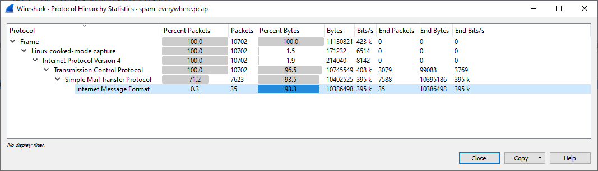
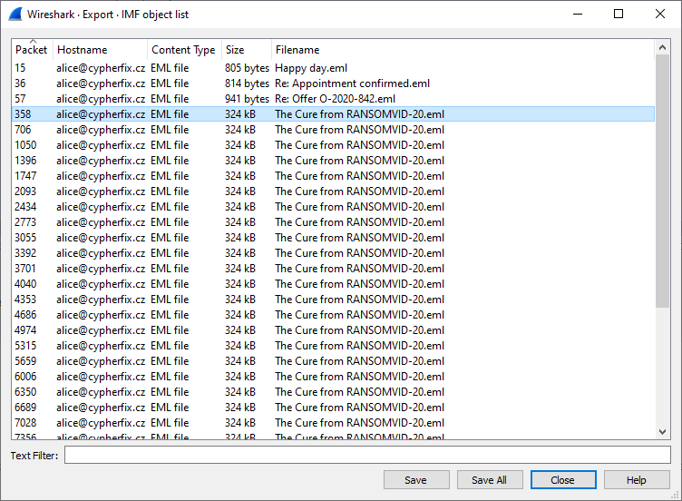

# Spam everywhere

Hi, junior investigator!

We get some recorded traffic, we believe you can analyze it and found whether it contains something malicious.

Use password `sPaMMerS-wOrKS` to [download the evidence](spam_everywhere.zip)

Good Luck!

---

Download and unzip the evidence:

```
$ ls
spam_everywhere.pcap
spam_everywhere.pcap.md5
```

We have a [PCAP file](https://fileinfo.com/extension/pcap) here which means it's time for [Wireshark](https://www.wireshark.org/).

Open the file in _Wireshark_ and do some basic analysis.

Go to _Statistics_ / _Protocol Hierarchy_



We are dealing with [Internet Message Format](https://wiki.wireshark.org/IMF).

Let's extract the messages. 

Go to _File_ / _Export Objects_ / _IMF_ and save all messages into a folder.



Open [The Cure from RANSOMVID-20.eml](The%20Cure%20from%20RANSOMVID-20.eml) in, for example,
_Microsoft Outlook_ and save the attachment `rv20protector.png`:


The flag is `FLAG{SaXY-u8fc-p1Kv-oXoT}`

