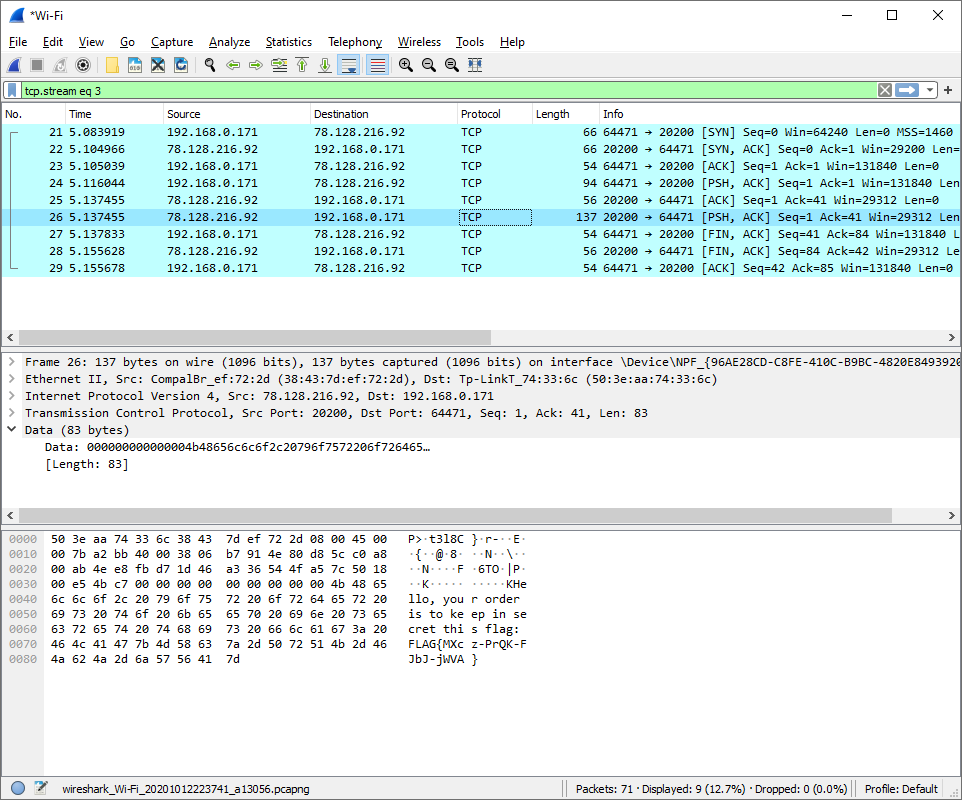

# Easy Bee

Hi, junior investigator!

We have for you something malicious called "Easy Bee". We believe that you can analyze it and found what is its purpose.

Use password `eAsY-beE-mAlWr-20` to [download the evidence](easy_bee.zip)

Good Luck!

---

Download and unzip the evidence:

```
$ ls
easy_botnet_client.exe*
easy_botnet_client.exe.md5
```

Run the EXE file:
```
Hello, I'm Easy-Bee-c6c91fum, give a copy of me to your friends!
Starting
Order received.
Order received.
```

And then the program exits.

Looks like there is some network communication in the background. Again, let's use _Wireshark_ to capture
the network traffic.



The client receives those messages:
```
Easy-Bee-9qaqmh2f ready for work
Hello, your order is to keep in secret this flag: FLAG{MXcz-PrQK-FJbJ-jWVA}
```
