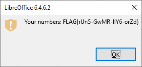

# Malware spreading

Hi, executive senior investigator!

We suspect that the malware is primarily spreaded somehow by e-mail. We have partial traffic dump from one small company, that was attacked. Try to check this hypothesis.

Use password `ThE-MaLWr-MaIlZZz-20` to [download the evidence](malware_spreading.zip)

Good Luck!

---

Download and unzip the evidence:

```
$ ls
malware_spreading.pcap
malware_spreading.pcap.md5
```

This challenge is quite similar to [Spam everywhere](../../01-training-ground/02-spam-everywhere/README.md).

Open the PCAP file in _Wireshark_ and, again, export all the email messages.

Reading through the emails, one of the conversations is really suspicious:


> Special offer
>
> From: Lorem Ipsum <lorem@genuine-national-lottery.cz>
>
> To: Alice Nelson <alice@cypherfix.cz>
>
> Dear customer,
I'm IT specialist in The Nation Lottery and I have an exciting offer for you! I can tell you in advance which numbers will be drawn!
>
> I can't win it myself, because it will be very suspicious. I will tell you the secret if you promise to give me 30 % of the prize. I trust you, so no payment in advance, no credit cards or other deceptions.
>
> If you agree, register to our newsletter at news.genuine-national-lottery.cz.
>
> Kind regards
> Lorem Ipsum

---

> The prediction
>
> From: Lorem Ipsum <lorem@genuine-national-lottery.cz>
>
> To: Alice Nelson <alice@cypherfix.cz>
>
> Dear Alice,
> I know it - you are the right person to cooperate. The numbers you are looking for, are in attachment. The password was send on your cell. Enjoy your (our) prize!
> 
> Lorem

The attachment is [winning_numbers.zip](winning_numbers.zip).
However, the archive is password protected. Let's read on.

---

> Rich rich rich! :-D
> 
> From: Alice Nelson <alice@cypherfix.cz>
>
> To: John Johnson <john@cypherfix.cz>
> 
> Johnny, I need your help!
> I got the winning lottery numbers and we can be really rich :) But my computer is too slow or entro-something is wrong inside and it can't show me the numbers :(. I left a flash drive on your desk, run the only file that's there and gimme the results.
>
> Thanks and see ya!    
>
> A.

---

> Rich and stupid :)
> 
> From: Alice Nelson <alice@cypherfix.cz>
>
> To: John Johnson <john@cypherfix.cz>
> 
> Oh my, you will need the secret 'HappyWinner-paSSw00rd42'. See ya! A.

Now we have the password `HappyWinner-paSSw00rd42`. Unzip the archive. 
There is [nation_lottery_numbers.ods](nation_lottery_numbers.ods).

Open the document in [LibreOffice](https://www.libreoffice.org/download/download/)
and either allow the macros:



Or check the macros source code in _Tools_ / _Macros_:

```
Sub Main
	MsgBox("Your numbers: FLAG{rUn5-GwMR-IlY6-orZd}", MB_OK + MB_ICONEXCLAMATION)
	thisComponent.close(true)
end sub
```

The flag is `FLAG{rUn5-GwMR-IlY6-orZd}`
