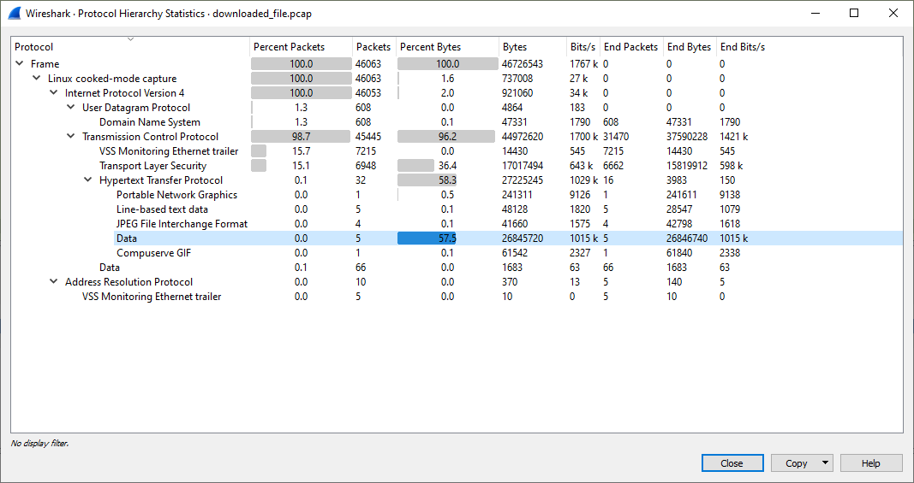

# Downloaded file

Hi, executive senior investigator!

The file, you have acquired in previous investigation is not the malware, we were looking for. The attacker probably replaced it to fool us. Fortunatelly, we have a traffic dump, where you can probably find the original file. Try to find it and do not forget to be sure it is the correct file.

Use password `ThE-doWNloAdeD-fIlE-20` to [download the evidence](downloaded_file.zip)

Good luck!

---

Download and unzip the evidence:

```
$ ls
downloaded_file.pcap
downloaded_file.pcap.md5
```

Open the traffic dump in _Wireshark_ and go to _Statistics_ / _Protocol Hierarchy_:



Most of the bytes come from HTTP so let's export all the objects (_File_ / _Export Objects_ / _HTTP_):


There are 5 binary files (we are looking for malware):
```
easybird_installer.bin
endpoint_security.bin
gimp_updater.bin
linux_core_update.bin
nuclear_client.bin
```

Let's try to execute them one by one (under Linux, those are `ELF 64-bit LSB executable` binaries):
```
./easybird_installer.bin
Connection failed, try again

..

./linux_core_update.bin
usage: linux_core_update.bin [-h] -ip IPADDRESS -p PORT
linux_core_update.bin: error: the following arguments are required: -ip/--ipaddress, -p/--port
```

Ha, this looks very familiar. I'm glad I wasn't lazy to de-obfuscate all the code from the previous challenge
[Attachment analysis](../02-attachment-analysis/README.md). Grab the IP and port from there.

```
./linux_core_update.bin -ip 78.128.216.92 -p 20210
FLAG{l03Y-BDjA-uB5v-PHVB}
```

The flag is `FLAG{l03Y-BDjA-uB5v-PHVB}`
