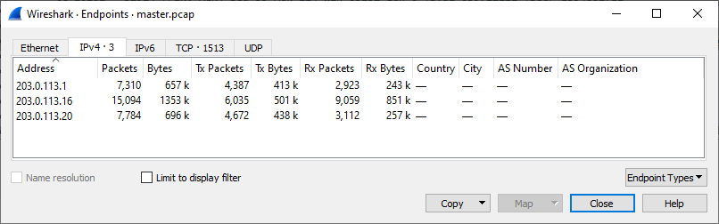

# Botnet master

Hi, executive senior investigator!

We have managed to get a rare catch - a traffic dump of issuing commands for the C2 server by its master! Glory to the network specialists of unnamed company. Try to find out how this communication works.

Use password `maSTeR-aND-coMMAndEr` to [download the evidence](botnet_master.zip)

Our network analytics report that one of currently online C2 servers can be found on IP `78.128.216.92` on `TCP/20220`.

Good luck!

---

Download and unzip the evidence:

```
$ ls
master.pcap
master.pcap.md5
```

Again, open the traffic dump in _Wireshark_ and go to _Statistics_ / _Protocol Hierarchy_:


It's all plain `TCP`. That's expected given what we know about the `client <--> C2 server`
communication from the previous challenge [The Connection](../04-connection/README.md).

This time it's also useful to see  _Statistics_ / _Endpoints_:



There ale 3 IP addresses only. Most likely master, C2 (command & control) server and a botnet client.

It's time to decode the messages. I did it in two steps:
1) Export all packets from _Wireshark_ matching `tcp.flags.push == 1` as JSON
into [packets.json](../../../../src/main/resources/cz/vernjan/ctf/catch20/packets.json).
2) Decode into plain text
using [BotnetMasterParser.kt](../../../../src/main/kotlin/cz/vernjan/ctf/catch20/BotnetMasterParser.kt)
(decoding of data is the same as in [The Connection](../04-connection/README.md)).
See [messages.txt](messages.txt).

Let's analyze [messages.txt](messages.txt). Indeed, only 3 IP addresses in play.
- Commands were sent from `203.0.113.1` (master) to `203.0.113.16:20202` (C2 server)
  ```
  203.0.113.1  --> 203.0.113.16/20202: ! kl5puyj43brf7iso;;wait;;*;;5;;944f8b5a851f3ee8c4c8d0a30ca2f2b94cc6a3371b9ca09c4634d2da4884c44e5afb7ea7329ce724e38d07d7a4ebcfeb
  203.0.113.16 --> 203.0.113.1 /33064: ! command accepted;;
  ```
- Both `203.0.113.20` and `203.0.113.1` act as botnet clients
  ```
  203.0.113.1  --> 203.0.113.16/20202:   1nhxcp2saj4d685g;;ready;;Linux
  203.0.113.16 --> 203.0.113.1 /33066:   wait;;5
  
  203.0.113.20 --> 203.0.113.16/20202:   dhps6t2u5egi1jrx;;ready;;Linux
  203.0.113.16 --> 203.0.113.20/55090:   wait;;5
  ```
 
There is one interesting command:
```
203.0.113.1  --> 203.0.113.16/20202: ! kl5puyj43brf7iso;;download;;0hpxc5sdo9kgne64;;/tmp/flag;;http://198.19.220.13:80/flag;;cfb8ad2096b87f07ef3154e198862bab81bce63cba14fd1ecd01ac83c849a42df494dd3b64793f4fad8cc02aa21ec61e
203.0.113.16 --> 203.0.113.1 /33346: ! command accepted;;
```

However, address http://198.19.220.13:80/flag cannot be reached.

Then I created [BotnetMasterController.kt](../../../../src/main/kotlin/cz/vernjan/ctf/catch20/BotnetMasterController.kt)
and start sending custom commands. The commands were accepted, but it was impossible to join the botnet nor to
change the botnet behaviour in any way (bummer).

To issue a custom command, you need to _sign_ it. The algorithm can be easily guessed.
Given `d954e7c208079d348f7763176a0a65b6b43f01c49439b970a7e73ab2d59c0a000c8cff64981f1e918ba110cd1de7dd24`
has 96 chars --> 48 bytes --> 384 bits this is [SHA-384](https://cs.wikipedia.org/wiki/Secure_Hash_Algorithm).

I discovered the flag by coincidence. Sending the command:
```
kl5puyj43brf7iso;;info;;78.128.216.92.20220;;clients;;b9817f590c8d6b39ea92740ccd2790ab568a1880670780dbcde7ab3f8d1a7f80c2e131a96553583f9b6691f981620870
```

I got back:
```
szqv0k7i3wc4x28p,hrf83ywuxan6g710,49vwpbry1gl2m0x6,gziok2nlvshjt40q,1wygo68xifsnmp25,7xdjquo5hnysgtc2,aj74zhq3015fnslx,03qorz2twbgs7dn5,njif5vhxol3u2zqs,5qmhkfxlypvreaon,5usy09oirlc7kpfw,efr64hyn3cw18dki,mdz2oi86trfvjne9,lip6xvmbkygsco0z,gdn9ezq2kws3j75c,rznc103kgapltqfh,17kg28eija94xboz,sb34f2z7eg9d8kqx,kl8ghams92i0eyx3,dzyv84kbw7oxtfn5,fug89xtjcv3mylh1,if98ld2bvks5y41n,9ut5d0xwc12ehk3v,54dyh0j9kr7atgs2,e9murav2goxjbn1h,dsyhzjkrtg7u31ma,dzisp1mjlera9b64,3r7n1c85avh2dewp,53ocnbl1dip4v2sr,f9hodvlme328cugy,s2glcnm65foupj4y,ew425f7gr136nk9x,9naeyqhitlu2xj7g,x0f8qt3dhvakw1pr,o0ix8mvnc634sfaq,1q67g5tamznxupoj,onf42p86xluc1vde,md4uoxz3tlfqny8a,lip1yr3h2d4vnst0,1rxncdmbw5f6e0u3,dla35suimgej8672,1qhxsfdznc7yl3ut,arg0c86nejf5qlot,sjfopm73htl80g9a,tcpnked0v7yr1jsl,790sqeuc8xpy6i5g,9hkqb1gow4piuzx3,2zcvdkf17rbhel4p,p6uyesvoqwa3m2t8,y1oxvtg6s7jqnuir,15cxr8z6p3jawv2s,a4mlendzthbck93q,w6ye1vcohgr0muzb,boas89lv4rxdnhp1,9z64srnua3tlm0hb,97mp2fkw8uxnsbcv,zcdlqsyb54xkaj3r,p48r36dmiy10cgob,fz0b2xh8wq3k7ytn,pxr1wao0c3y7k968,tgwi0v3ljpon8rx6,x9lkzhjavep1tcdr,2r93gq07iwd5xsn1,v2ci6yetwbhmq47j,da3wfjlecut24ghi,pjcub3mhaxr6sv92,epzldmoc4792ayv3,zrgmi85lyv36tjkc,nox2qftsu8r4ejvw,xp1cq2t67rysw54v,niajrtykf0b2q4x1,05lcrqzojsi61fv9,j74hqk0wtd2eimn3,te6pz5vn7bc8huqk,m43o85q6zpbc21nf,7lpu1o43r8kjzecv,c9migea7sq56b4wy,gfpmtn6qusaoi21h,nd9p0jz8a25bohts,mwptx7ig36lohend,ukg9jieh027w3xsc,dya8wlgo4r62zexp,wkputal7sqcr9jgv,0omjbhszlgdx5qp3,m1s5o8ivhkp6g0tl,cqn05tz9ji7a4vf8,nwg0lsdkjtr4ocpv,p8dnqclaz9wi2msb,oniem7aubg3904qd,xgu0wtjko815frpb,741lmb93dourecgw,dolbyeaq9nsj7txg,qtw7mc9xvpsbzj34,7d6wn1hps9r5aviu,e04ga962dxj57ct1,ua84w7xn0cmqzev1,FLAG{uLHI-3Zq1-kOHx-FGR1},kzp27qw9yamrxigl,ghuz38a56pqywxj1,6m5r08wou2eyjc3t,mfgnlpzj8e6c5drx,wv3zpf6sdo2bl40m,tkl183a7w6pfcbdr,85lozspa3frjc16t,d3eln7tvjgfqzmsb,tdk6arbc1qvu90ie,dij5hxla79zmqvc0,ngbc8vx413przlmt,1vd4kipyogc0q3x9,kci3gz28j9xyt0bn,r4hm6qkjoy18eswv,83pht7z2cdeuayxl,eto2cwz1savqiyf4,g2f1ai8bqek0jdwc,qbcwvdji249laeto,pm15oay9f6nhxkiu,ki2sr6jpd5lgxzua,m7v9qgo4xd2ury5p,m7i316p0a5vdhqrt,x5umzs3ohva2ni74,4k31jxfry9peu6go,mutykiaphbfrd5vz,yxkjgdabelhz4pv7,1gq6hulpkaesvr35,wmvu5xzoq90y7jst,mpfe0rq1cu5wxlh3,d79c0l1nxs5kturz,hj2mszx9c10b58ow
```

I didn't notice for the first time but there it is. Just search for `flag`: `FLAG{uLHI-3Zq1-kOHx-FGR1}`

A bit disappointment. I expected something more sophisticated as receiving the flag from the C2 server with a custom
client.
 