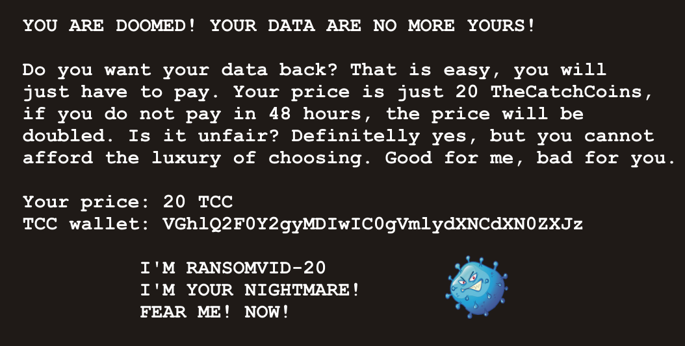

# Ransomware

Hi, executive senior investigator!

Finally, we have acquired the `RANSOMVID-20` encryption module. According to the information from our partners, it encrypts files on any drives, it can found. We have also one image of relatively small drive, which was affected by `RANSOMVID-20` only (no user or system action were undertaken). Try to find out how to decrypt the files without paying any single TCC.

Use password `rAnSOmVID-20` to [download the evidence](ransomware.zip)

Good luck!

**WARNING: The ransomware executable is dangerous - virtual machine is strongly recommended for the analysis.**

---

Download and unzip the evidence

```
$ ls
image.dd.gz
image.dd.gz.md5
ransomvid_20.exe
ransomvid_20.exe.md5
```

## Image analysis

Start with exploring the image.
(G)unzip it and mount it (see [How To Mount ISOs And Other Image File Types In Linux](https://fossbytes.com/mounting-isos-image-file-types-in-linux/)):

```
$ gunzip image.dd.gz
$ file image.dd
image.dd: DOS/MBR boot sector, code offset 0x52+2, OEM-ID "NTFS    ", sectors/cluster 8, Media descriptor 0xf8, sectors/track 0, dos < 4.0 BootSector (0x80), FAT (1Y bit by descriptor); NTFS, sectors 4194303, $MFT start cluster 4, $MFTMirror start cluster 262143, bytes/RecordSegment 2^(-1*246), clusters/index block 1, serial number 0328e9db0076a2c94; contains bootstrap BOOTMGR
$ losetup -P -f image.dd
$ mkdir ransom
$ mount /dev/loop0 ransom
```

Let's explore the image contents:
```
$ file *
c.a.t.-backup: directory
flags:         directory
private:       directory
_README.png:   PNG image data, 1054 x 534, 8-bit/color RGB, interlaced
_README.txt:   ASCII text, with CRLF line terminators
```

Here is `_README.txt`:
```
YOU ARE DOOMED! YOUR DATA ARE NO MORE YOURS!

Do you want your data back? That is easy, you will
just have to pay. Your price is just 20 TheCatchCoins,
if you do not pay in 48 hours, the price will be 
doubled. Is it unfair? Definitelly yes, but you cannot
afford the luxury of choosing. Good for me, bad for you.

Your price: 20 TCC 
TCC wallet: VGhlQ2F0Y2gyMDIwIC0gVmlydXNCdXN0ZXJz

I'M YOUR NIGHTMARE, I'M RANSOMVID-20, FEAR ME!
```

The TCC wallet decodes to `TheCatch2020 - VirusBusters`. Unlikely of any importance.

Let' see `_README.png`:


Fast check up using `exiftool`, `strings` and [Forensically](https://29a.ch/photo-forensics/)
revealed nothing interesting.

Continue with `private` folder:
```
$ file *
000-0514_Antares_WP.pdf:                                data
aboveamber081103.pdf:                                   data
A_Sure_Bet-Implementing_High_Availability_Internet.pdf: data
DRdecisionmodel.pdf:                                    data
DRXpert-whitepaper.pdf:                                 data
iustum.txt:                                             data
_README.png:                                            PNG image data, 1054 x 534, 8-bit/color RGB, interlaced
_README.txt:                                            ASCII text, with CRLF line terminators
SAP_DR_White_Paper.pdf:                                 data
tabletop.pdf:                                           data
United Breaks Guitars.mp4:                              ISO Media, MP4 Base Media v1 [IS0 14496-12:2003]
```

PDF and TEXT files were encrypted.
 
Also, all images in `flags` folder were encrypted:
```
$ file *
195-flag.png:   data
check_flag.png: data
n_flags.jpg:    data
_README.png:    PNG image data, 1054 x 534, 8-bit/color RGB, interlaced
_README.txt:    ASCII text, with CRLF line terminators
UFTP_flag.svg:  data
```

Lastly, the same applies for all images in `c.a.t.-backup` folder:
```
$ file *
001-5d9ecf3560a49__700.jpg: data
002-5d9ecf3784015__700.jpg: data
003-5d9ecf3a1be63__700.jpg: data
004-5d9ecf3c31399__700.jpg: data
007-5d9ecf421f9ce__700.jpg: data
008-5d9ecf43f1c51__700.jpg: data
009-5d9ecf45eb61c__700.jpg: data
010-5d9ecf47cbaff__700.jpg: data
011-5d9ecf49c9d36__700.jpg: data
012-5d9ecf4bc4992__700.jpg: data
013-5d9ecf4da78b2__700.jpg: data
014-5d9ecf4feace8__700.jpg: data
015-5d9ecf51ec173__700.jpg: data
B1yMeAhgyKg-png__700.jpg:   data
B267yj_Aon7-png__700.jpg:   data
B2BRM22Af7K-png__700.jpg:   data
B2gEN7hAePs-png__700.jpg:   data
B2lxFNwgwEF-png__700.jpg:   data
B2POMIOgVfj-png__700.jpg:   data
B2qdOdYAjyg-png__700.jpg:   data
B2tJN7wgHc9-png__700.jpg:   data
B2UdRHFgmrT-png__700.jpg:   data
B2Ztrd1gG-P-png__700.jpg:   data
B2zU4Ykg8JK-png__700.jpg:   data
B3d7XoXALWe-png__700.jpg:   data
B3HhJJxA9c3-png__700.jpg:   data
B3OFN9cgLwX-png__700.jpg:   data
B3PDFVJgCcy-png__700.jpg:   data
B3Qxy_BANdv-png__700.jpg:   data
B3RIhHNAdk4-png__700.jpg:   data
_README.png:                PNG image data, 1054 x 534, 8-bit/color RGB, interlaced
_README.txt:                ASCII text, with CRLF line terminators
```

## Playing with ransomvid_20.exe

Okay, let's take a look at `ransomvid_20.exe`:
```
> ransomvid_20.exe
usage: ransomvid_20.exe [-h] -p PATH -k KEYFILE
ransomvid_20.exe: error: the following arguments are required: -p/--path, -k/--keyfile
```

### Factorizing RSA modulus (dead end)

Remember, we found an [RSA public key](public.pem) in [The Connection](../04-connection) challenge.

Maybe it's the key which was used for the encryption? Let's check if the modulus can be factorized.

Get the RSA modulus:
```
$ openssl rsa -pubin -noout -text < public.pem 
RSA Public-Key: (2048 bit)
Modulus:
    00:df:db:ad:90:3d:50:b7:0d:17:12:32:dc:65:f8:
    b2:d7:49:ef:0b:e9:dc:4e:35:96:c5:36:49:d3:f3:
    b9:ce:f1:b3:80:b1:c9:32:59:3c:04:63:61:c7:e4:
    dc:4a:66:3d:1a:66:5f:a3:e1:74:74:60:7a:85:20:
    63:fe:8e:b3:da:c6:de:ef:3c:4e:ba:03:53:49:fe:
    38:9c:7a:ea:b8:de:df:0c:fd:9e:c1:7e:f0:d2:5a:
    1e:a4:dc:97:d7:46:31:3b:21:88:f9:ea:11:b7:83:
    a5:54:83:e4:4d:56:53:e1:4c:ac:24:6e:56:19:cf:
    87:c0:dc:a0:4f:fc:c1:ca:41:08:1c:14:fb:d8:28:
    af:ad:92:f5:91:e0:4b:fd:47:7f:a2:49:10:f6:66:
    8b:ff:28:15:90:ab:11:22:95:37:c9:0b:3f:79:ac:
    4d:1c:46:bd:8d:a6:9c:40:05:fa:5c:76:0f:47:28:
    a6:96:60:a9:86:20:e4:c5:11:af:bc:7e:68:e6:a4:
    0b:8a:e8:50:a4:e7:09:c1:1e:4d:14:e7:b7:80:df:
    7d:47:37:d6:8f:b7:1c:e4:7c:14:20:bc:1e:2c:90:
    dd:7f:d7:e0:1c:44:e1:c6:b7:f9:5d:f6:3f:32:9e:
    59:ff:c1:ca:87:82:bc:89:0f:69:3d:08:a2:42:93:
    83:f9
Exponent: 65537 (0x10001)
```

The modulus is (without the leading `00`):
```
dfdbad903d50b70d171232dc65f8b2d749ef0be9dc4e3596c53649d3f3b9cef1b380b1c932593c046361c7e4dc4a663d1a665fa3e17474607a852063fe8eb3dac6deef3c4eba035349fe389c7aeab8dedf0cfd9ec17ef0d25a1ea4dc97d746313b2188f9ea11b783a55483e44d5653e14cac246e5619cf87c0dca04ffcc1ca41081c14fbd828afad92f591e04bfd477fa24910f6668bff281590ab11229537c90b3f79ac4d1c46bd8da69c4005fa5c760f4728a69660a98620e4c511afbc7e68e6a40b8ae850a4e709c11e4d14e7b780df7d4737d68fb71ce47c1420bc1e2c90dd7fd7e01c44e1c6b7f95df63f329e59ffc1ca8782bc890f693d08a2429383f9
```

Converted to DEC:
```
28259469257851162140433041562915839534604916977089916630050741557595062932029917582656421574983417582732592568570061973093490027149530225492698446897403428826895008909048138710999496621741476032383484776124170440964234834652346625945755185894266052319700419970292021931572029994869995833433882001789583715667373636783404247322812495489723459377328112480568600805898156953229153796219851979407399600940977061336489224227934909487762934123182814599334912203173622419980153246002708005517519261058544713935666759493577704642517507181337153451242450104855027845727427948929383240071358698336025628205636752579844155606009
```

I tried my favorite http://factordb.com/. Not useful here. Then I discovered this nice
[RsaCtfTool](https://github.com/Ganapati/RsaCtfTool). No, no - this key looks solid.

## Reversing ransomvid_20.exe

Time to get our hands dirty and reverse `ransomvid_20.exe`.

At first, I tried my favorite tools such as [Hopper](https://www.hopperapp.com/),
[Ghidra](https://ghidra-sre.org/) and [OllyDbg](http://www.ollydbg.de/).
Not very useful in this case. This is a 5 MB binary...

Next, I tried to do some chosen plaintext attacks using `00` or `FF` files hoping
to perhaps leak the key in some way. Again, no luck. At least I understood the pattern
common to all encrypted files:
```
RV20 + random 2048 bits of something + 8 bytes with the length of the original data + encrypted data
```

Then, I noticed one thing when I accidentally entered a wrong key path:
```
> ransomvid_20.exe -p test -k foo
Found 1 files
  test/hello.txt
Traceback (most recent call last):
  File "ransomvid_20.py", line 167, in <module>
  File "ransomvid_20.py", line 156, in main
  File "ransomvid_20.py", line 102, in read_rsakey
FileNotFoundError: [Errno 2] No such file or directory: 'foo'
[5660] Failed to execute script ransomvid_20
```

**It's Python inside!** See [pyinstaller](https://www.pyinstaller.org/).

The key question was _How to extract the script from the exe_? Since I haven't done this before,
it took me much more time than I'd like.

After many trials and errors with
[pyi-archive_viewer](https://pyinstaller.readthedocs.io/en/stable/advanced-topics.html#using-pyi-archive-viewer)
and [uncompyle6](https://pypi.org/project/uncompyle6/)
I finally discovered [pyinstxtractor](https://github.com/extremecoders-re/pyinstxtractor).

**Be sure to [use version 2.0](https://reverseengineering.stackexchange.com/questions/23522/decompiling-python-files-valueerror)!**

```
> pyinstxtractor.py ransomvid_20.exe
[*] Processing ransomvid_20.exe
[*] Pyinstaller version: 2.1+
[*] Python version: 36
[*] Length of package: 5132566 bytes
[*] Found 24 files in CArchive
[*] Beginning extraction...please standby
[+] Possible entry point: pyiboot01_bootstrap
[+] Possible entry point: pyi_rth_multiprocessing
[+] Possible entry point: ransomvid_20
[*] Found 213 files in PYZ archive
[*] Successfully extracted pyinstaller archive: ransomvid_20.exe

You can now use a python decompiler on the pyc files within the extracted directory
```

Let's see what we got:
```
$ file *
PYZ-00.pyz:                                              data
PYZ-00.pyz_extracted:                                    directory
VCRUNTIME140.dll:                                        PE32 executable (DLL) (console) Intel 80386, for MS Windows
_bz2.pyd:                                                PE32 executable (DLL) (GUI) Intel 80386, for MS Windows
_ctypes.pyd:                                             PE32 executable (DLL) (GUI) Intel 80386, for MS Windows
_decimal.pyd:                                            PE32 executable (DLL) (GUI) Intel 80386, for MS Windows
_hashlib.pyd:                                            PE32 executable (DLL) (GUI) Intel 80386, for MS Windows
_lzma.pyd:                                               PE32 executable (DLL) (GUI) Intel 80386, for MS Windows
_multiprocessing.pyd:                                    PE32 executable (DLL) (GUI) Intel 80386, for MS Windows
_socket.pyd:                                             PE32 executable (DLL) (GUI) Intel 80386, for MS Windows
_ssl.pyd:                                                PE32 executable (DLL) (GUI) Intel 80386, for MS Windows
base_library.zip:                                        Zip archive data, at least v2.0 to extract
pyexpat.pyd:                                             PE32 executable (DLL) (GUI) Intel 80386, for MS Windows
pyi-windows-manifest-filename ransomvid_20.exe.manifest: empty
pyi_rth_multiprocessing.pyc:                             python 3.6 byte-compiled
pyiboot01_bootstrap.pyc:                                 python 3.6 byte-compiled
pyimod01_os_path.pyc:                                    python 3.6 byte-compiled
pyimod02_archive.pyc:                                    python 3.6 byte-compiled
pyimod03_importers.pyc:                                  python 3.6 byte-compiled
python36.dll:                                            PE32 executable (DLL) (GUI) Intel 80386, for MS Windows
ransomvid_20.exe.manifest:                               XML 1.0 document, ASCII text, with CRLF line terminators
ransomvid_20.pyc:                                        python 3.6 byte-compiled
select.pyd:                                              PE32 executable (DLL) (GUI) Intel 80386, for MS Windows
struct.pyc:                                              python 3.6 byte-compiled
unicodedata.pyd:                                         PE32 executable (DLL) (GUI) Intel 80386, for MS Windows
```

Here it is - `ransomvid_20.pyc`.

Decompile running `uncompyle6 ransomvid_20.pyc` and, finally, rejoice upon
getting the encryption script [ransomvid.py](ransomvid.py).

## Breaking the encryption

Reverting the encryption is quite easy. The vulnerability is in using the same
seed for random:
```
init_random(2020)
``` 

This way the AES keys are always the same. I slightly modified the original script
and use it for decryption (see [ransomvid-decrypt.py](../../../../src/main/python/catch20/ransomvid-decrypt.py)):
```python
def read_enc_file(filename):
    with open(filename, 'rb') as (fileh):
        data = fileh.read()
    return data[4 + 256 + 8:]               # Skip RV20 + encrypted AES key + length

def aes_decrypt(data, aeskey):
    aes = pyaes.AESModeOfOperationCTR(aeskey)
    encdata = aes.decrypt(data)             # Use decrypt here
    return encdata

def write_file(filename, data):
    with open(filename, 'wb') as (fileh):   # Write the decrypted data
        fileh.write(data)

for filename in filenames:
    aeskey = get_random_aes_key(32)         # Key is the same
    enc_data = read_enc_file(filename)      # Change to read_enc_file 
    data = aes_decrypt(enc_data, aeskey)    # Change to aes_decrypt 
    write_file('{}'.format(filename), data)
```

It's important to decrypt the whole image with all the original files.
Otherwise, the AES keys won't match! So either delete all `__README.png_`
and `_README.txt` or make sure to skip them in the code.

Once the image is decrypted, search for the flag.
It's hidden in [iustum.txt](iustum.txt).

The final flag is `FLAG{TMMW-rUaP-B2Ko-XejX}`