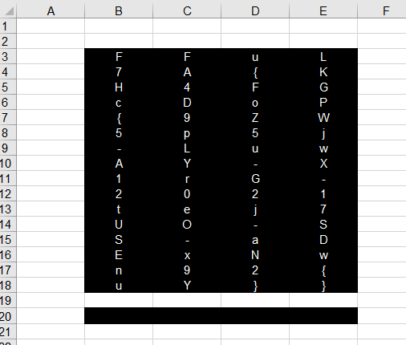

# Unknown File

Hi Expert,

young archeaologist show you a file downloaded from USB-altar in recently discover ruins of former cathedral. The file has no suffix, so it wont open in any application installed in archaeologist field computer. Prove you skill and found the information inside the unknown file.

Download the file [uknown_file.zip](unknown_file.zip) (sha256 fingerprint: `8529e7fef5975a923786523ed7a5c7df8e95fa6907a41e81770e020932df862b`).

---

Let's identify the file:
```
$ file unknown_file
unknown_file: OpenDocument Spreadsheet
```

Ok, append `.ods` and open with Excel or similar:



If you select the bottom black rectangle, you can see the formula:
```
=CONCAT(B3;E3;C4;E5;B7;C7;D7;B8;E8;B9;D9;B10;C10;C11;E11;C13;D13;B14;C14;C15;C16;E16;B17;C18;D18)
```

Change the cell color into white:


Copy and paste as value: `FLAG{9Z5j-uAYr-ejUO-xwnY}`