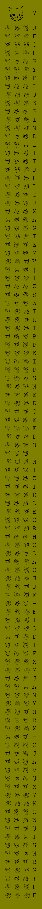
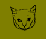

# Cat Heads Language

Hi Expert,

an archaeologist specialized in cats cultures asks you for help. You have to reveal secret message in the ancient parchment - the conversion of cat heads to ascii is already done (the cat language is beyond normal human mind, you have to become a cat to understand it), but nobody knows which characters should be dropped and which should be kept. As the archaeologist gave you the parchment image and meowed what to do, he climbed onto the cabinet, curled into a ball, and started to purr. Prove your skill and get the secret message.

Download the file [parchment_transcription.zip](parchment_transcription.zip) (sha256 fingerprint: `52ffbfef4c031851ba7b82058630a0ebb327b0f0efdfce6ddfddc8949a16c40b`).

---

This is the cat parchment:

We know the flag format. It's always `FLAG{xxxx-xxxx-xxxx-xxxx}`. Using this knowledge,
we can deduce the pattern - pick letters with

The flag is `FLAG{WISE-NICE-DEAR-CATS}`