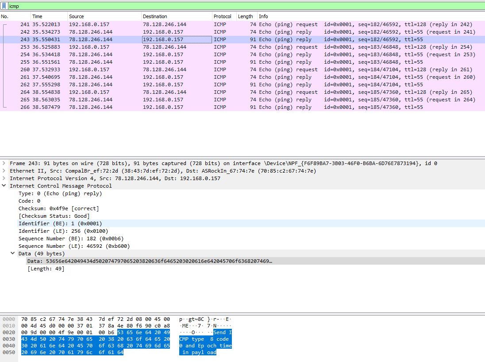
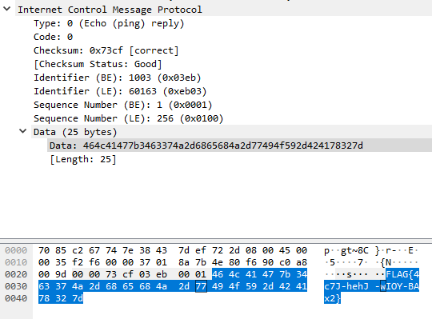

# Unknown server

Hi Expert,

the archaeologist have found strange server on IP `78.128.246.144`. Although it replies to ping, no services are present. Check the purpose of the server.

Good Luck!

---

Start [Wireshark](https://www.wireshark.org/) and try to ping the server.

Linux reports 100% packet loss:
```
$ ping 78.128.246.144
PING 78.128.246.144 (78.128.246.144) 56(84) bytes of data.
^C
--- 78.128.246.144 ping statistics ---
15 packets transmitted, 0 received, 100% packet loss, time 14023ms
```

On Windows, ping works well:
```
> ping 78.128.246.144

Pinging 78.128.246.144 with 32 bytes of data:
Reply from 78.128.246.144: bytes=32 time=12ms TTL=55
Reply from 78.128.246.144: bytes=32 time=8ms TTL=55
Reply from 78.128.246.144: bytes=32 time=7ms TTL=55
Reply from 78.128.246.144: bytes=32 time=8ms TTL=55

Ping statistics for 78.128.246.144:
    Packets: Sent = 4, Received = 4, Lost = 0 (0% loss),
Approximate round trip times in milli-seconds:
    Minimum = 7ms, Maximum = 12ms, Average = 8ms
```



The server responds with _ICMP reply_ containing message `Send ICMP type 8 code 0 and Epoch time in payload`.

Let's do that:
```
$ nping -c 1 --icmp --data-string "$(date +'%s')" 78.128.246.144
SENT (0.0034s) ICMP [*** > 78.128.246.144 Echo request (type=8/code=0) id=3604 seq=1] IP [ttl=64 id=62198 iplen=38 ]
RCVD (0.0294s) ICMP [78.128.246.144 > *** Echo reply (type=0/code=0) id=3604 seq=1] IP [ttl=54 id=62198 iplen=53 ]
```



The flag is `FLAG{4c7J-hehJ-wIOY-BAx2}`