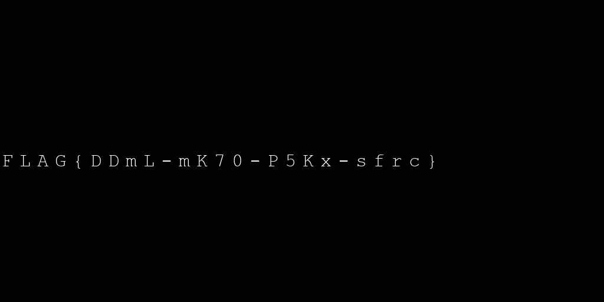

# Docker Image

Hi Expert,

some leads indicates presence of interesting information in seized docker image, examine it and find what you can.

Download the file [tcc_docker_42.zip](https://owncloud.cesnet.cz/index.php/s/XubphgN4onkZx7P/download) (sha256 fingerprint : `d7173155c0c9890a94eb9ad1479590a80b078ca771d4fd679df0e3c032440f9a`).

Good Luck!

---

Docker images are bundled as _tars_.
Untar and let's take a look at the config file `415d3d922eaaf2a95cc7a0ff1777d0e9096db9853bc78ae9655224d5279aad45.json`.
Interesting part is `history`:
```json
"history":[
      {
         "created":"2021-08-27T17:19:45.553092363Z",
         "created_by":"/bin/sh -c #(nop) ADD file:aad4290d27580cc1a094ffaf98c3ca2fc5d699fe695dfb8e6e9fac20f1129450 in / "
      },
      {
         "created":"2021-08-27T17:19:45.758611523Z",
         "created_by":"/bin/sh -c #(nop)  CMD [\"/bin/sh\"]",
         "empty_layer":true
      },
      {
         "created":"2021-10-01T19:54:24.238526139Z",
         "created_by":"/bin/sh -c apk add --no-cache python3"
      },
      {
         "created":"2021-10-01T19:54:28.157053835Z",
         "created_by":"/bin/sh -c apk add --no-cache vim"
      },
      {
         "created":"2021-10-01T19:54:28.443308394Z",
         "created_by":"/bin/sh -c #(nop) COPY file:10f3a158e4fc35253cdf9520b3fdfa4118febc6cf77deecdae4598aea9352b46 in /usr/sbin/init "
      },
      {
         "created":"2021-10-01T19:54:29.259202981Z",
         "created_by":"/bin/sh -c echo \"Why python3? Python2 ought be enough for everybody!\"",
         "empty_layer":true
      },
      {
         "created":"2021-10-01T19:54:30.027549323Z",
         "created_by":"/bin/sh -c rm -f /usr/sbin/init"
      },
      {
         "created":"2021-10-01T19:54:30.259180443Z",
         "created_by":"/bin/sh -c #(nop) COPY file:c65716363f977f21c8d170d0a479c2c1e6deaa8efab4a1bbbec0bb1d81853b08 in /usr/sbin/init "
      },
      {
         "created":"2021-10-01T19:54:33.313257569Z",
         "created_by":"/bin/sh -c apk add --no-cache mc"
      },
      {
         "created":"2021-10-01T19:54:35.367049417Z",
         "created_by":"/bin/sh -c apk add --no-cache screen"
      },
      {
         "created":"2021-10-01T19:54:35.623818306Z",
         "created_by":"/bin/sh -c #(nop) COPY file:c65716363f977f21c8d170d0a479c2c1e6deaa8efab4a1bbbec0bb1d81853b08 in /usr/sbin/init "
      },
      {
         "created":"2021-10-01T19:54:35.820638619Z",
         "created_by":"/bin/sh -c #(nop)  CMD [\"/bin/sh\"]",
         "empty_layer":true
      }
   ],
```

In the following step, someone copied a file into `/usr/sbin/init`:
```json
{
  "created": "2021-10-01T19:54:28.443308394Z",
  "created_by":"/bin/sh -c #(nop) COPY file:10f3a158e4fc35253cdf9520b3fdfa4118febc6cf77deecdae4598aea9352b46 in /usr/sbin/init "
},
```

Later, the same file was deleted:
```json
{
 "created":"2021-10-01T19:54:30.027549323Z",
 "created_by":"/bin/sh -c rm -f /usr/sbin/init"
},
```

That could be interesting. How can we recover the file? Either, you can search through all the layers, or take a bit more sophisticated
approach. Counting from top, adding the file was the 4th step which modified the filesystem somehow. Therefore, looking into `manifest.json`,
we can deduce we are interested in the 4th layer: `e3818d57b2fe4d0da46473951eb0da7e04a3e234bb81e893544a24c8276fc89c/layer.tar`.

Untar this layer and find contents of `/usr/sbin/init`:
```python
#!/usr/bin/env python
# -*- coding:utf-8 -*-
"""
Image generator
"""

__author__ = "G. I. Jane @ TCC"
__version__ = "1.0"

import sys
import argparse
from PIL import Image
from PIL import ImageFont
from PIL import ImageDraw

def get_args():
	"""
	Cmd line argument parsing (preprocessing)
	"""
	# Assign description to the help doc
	parser = argparse.ArgumentParser(\
		description='Image generator"')

	# Add arguments
	parser.add_argument(\
		'-f',
		'--filename',
		type=str,
		help='Target file',
		required=True)


	# Array for all arguments passed to script
	args = parser.parse_args()

	# Return arg variables
	return args.filename


def main():
	"""
	Main function
	"""

	# check python version
	if sys.version_info[0] < 3:
		print("ERROR: Python3 required.")
		sys.exit(1)

	# process args
	filename = get_args()

	# generate image
	var = ['651', '1L0', '5D0', '6D0', '301', '2A0', '3G0', '2r2', '4{0', '7K1', '1f2', '4}2', '9-1', '8L0', '8x1', '1K1', '0s2', '0m1', '0F0', '271', '5P1', '7m0', '4-1', '9-0', '3c2']
	tim = Image.new("RGB", (1024, 512), (0, 0, 0))
	font = ImageFont.truetype('cour.ttf', 32)
	draw = ImageDraw.Draw(tim)
	for v in var:
		draw.text((int(v[2])*300 + int(v[0])*30 + 3, 255), v[1], (255, 255, 255), font=font)
	try:
		tim.save(filename+".png")
	except Exception:
		print("File saving failed ...")
		sys.exit(2)

main()

#EOF

```

Nice, let's run it. Install [Pillow](https://pypi.org/project/Pillow/) and download
[cour.ttf](https://www.fontsupply.com/fonts/C/Cour.html) font.

```
$ python3 init -f flag
$ file flag.png 
flag.png: PNG image data, 1024 x 512, 8-bit/color RGB, non-interlaced
```

