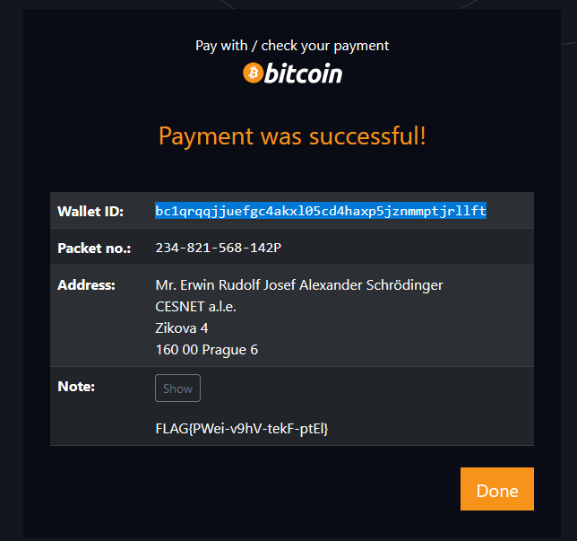

# Bitcoin wallet

Hi, promising candidate,

our customers paying by bitcoin to our wallet `bc1q8vnufzpyurlnvrxavrn2vxe5z0nafrp2d8nzng` can get their package pickup
code on http://pay-check.mysterious-delivery.thecatch.cz by entering their wallet ID.

Find out the pickup code for package that has not yet been claimed, although it was already paid for on Aug 8th 2022.

May the Packet be with you!

---

First, we need to find the sender's wallet ID. Either look it up on https://www.blockchain.com/ or just
paste the wallet ID into google.

- https://www.blockchain.com/btc/tx/dc6044842cd60dc35f42f553cc14705e2e9b3972ec67cf82fd570afe3e40aedd
- or https://hashxp.org/tx/dc6044842cd60dc35f42f553cc14705e2e9b3972ec67cf82fd570afe3e40aedd

Sender's wallet ID is `bc1qrqqjjuefgc4akxl05cd4haxp5jznmmptjrllft`

Enter it to http://pay-check.mysterious-delivery.thecatch.cz/

The flag is `FLAG{PWei-v9hV-tekF-ptEl}`