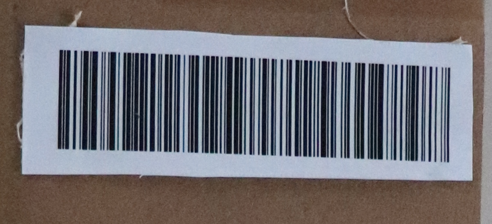

# Unknown package

Hi, promising candidate,

the cleaning drones have taken pictures of some abandoned unknown package in our backup depot. The AI claims that the
analysed item is in no way a package, instead it repeats "cat - animal - dangerous - avoid".

Get as much as possible information about the package.

Download [taken pictures](https://owncloud.cesnet.cz/index.php/s/YxcC6BP430nR5en) (MD5
checksum `c6f700e1217c0b17b7d3a35081c9fabe`).

May the Packet be with you!

---

There is a QR code and a couple of barcodes. Scan all the codes and find the flag.



I used https://online-barcode-reader.inliteresearch.com/

```
Barcode:	1 of 1	Type:	Code128		Page 1 of 1
Length:	25	Rotation:	upsideDown
Module:	2.8pix	Rectangle:	{X=127,Y=111,Width=874,Height=252}
FLAG{PWei-v9hV-tekF-ptEl}
```