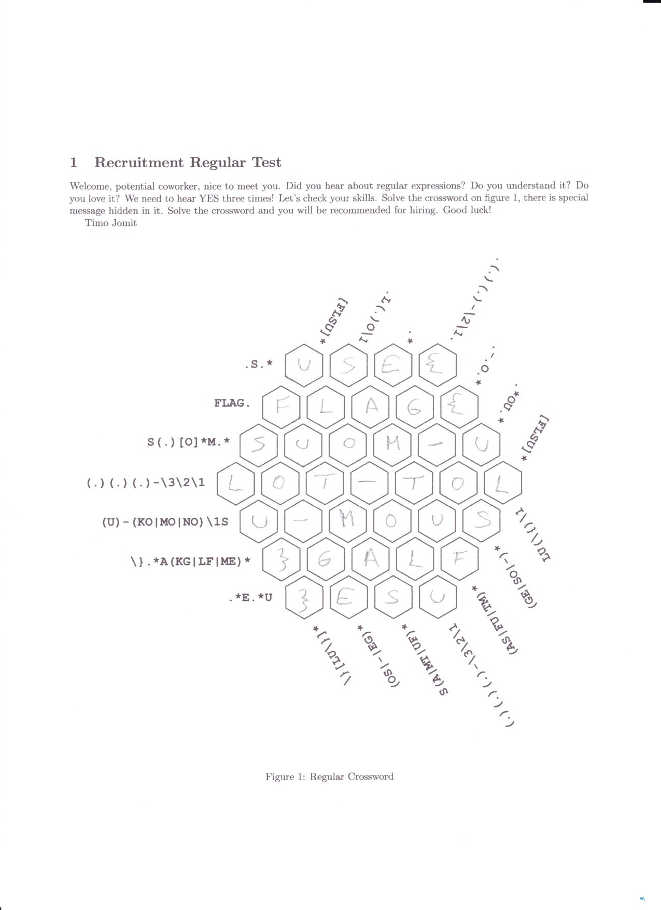

# Regex crossword

Hi, promising candidate,

you have to prove the knowledge of regular expressions. Our Finnish recruiter Timo has prepared some crossword suitable
for this purpose.

Download task [description](regex_crossword.zip) (MD5 checksum `6448c1748cc6047470a5f00c3945c1c4`).

May the Packet be with you!

---

In case you need help with regexes, use https://regex101.com/

The flag is `FLAG{SUOM-ULOT-TOLU-MOUS}`