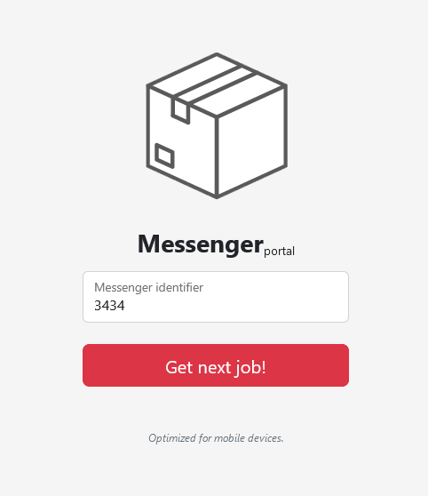
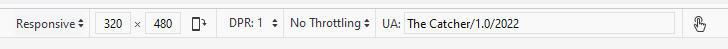

# Messenger portal

Hi, packet inspector,

our messengers are dependent on aplication called `Messenger portal` when they are in the field. It allows to display
various information they need to do their jobs on their special mobile devices.

Currently, the AI has installed new modern and fully responsive version of the `Messenger portal` – even the validation
of
messenger numeric ID is not implemented yet and the messengers report problem with displaying details of they
deliveries.

You have to analyze the [Messenger portal](http://messenger-portal.mysterious-delivery.thecatch.cz/) and find some way
to get detail information about deliveries. Hurry, please,
the packages are pilling up!

May the Packet be with you!

---

This is the portal


Entering any message ID has no real effect. However, looking into _Console_ you can read:

```
Detected unsupported device. Only mobile devices are supported.
```

I switched Firefox into Responsive Design Mode (`ctrl + shift + m`).

This is the first step. Behind the scenes, the screen width is passed onto the server as base64 encoded
param: `messenger: "MzIw"`).

Now the Console log message changes into:

```
Detected unsupported web browser! Only  is supported.
```

Ok, let's set `User-agent` header to identify as `The Catcher/1.0/2022`.



Console log:
```
Detected unsupported OS! Only MessengerOS is supported.
```

Change `User-agent` into `The Catcher/1.0/2022 (MessengerOS)`

Almost there. The result page is trying to load in an iframe but it's denied by HTTP header `X-Frame-Options: DENY`.
```
The loading of “http://messenger-portal.mysterious-delivery.thecatch.cz/?messenger-jobs” in a frame is denied by “X-Frame-Options“ directive set to “DENY“
```

Let's try to access it directly (`/?messenger-jobs`) (make sure you are still in Responsive design mode and sending correct `User-agent`):
```
Only requests from messenger-portal.mysterious-delivery.thecatch.cz server are allowed.
```

Direct access is blocked. Nevertheless, there is an easy bypass ising `Referer` header.
Add `Referer: http://messenger-portal.mysterious-delivery.thecatch.cz/`:

```
<p>
<strong>Recipient:</strong><br>
CESNET, z. s. p. o.
</p>
<p>
<strong>Address:</strong><br>
Zikova 4, Praha<br>
160 00
</p>
<p>
<strong>Note:</strong><br>
<span style="direction: rtl; unicode-bidi: bidi-override !important;">{EEw1-z9Tx-6Hb3-nJjC}GALF</span>
</p>       
```

Flag is displayed in reverse. Fix it and grab `FLAG{CjJn-3bH6-xT9z-1wEE}`