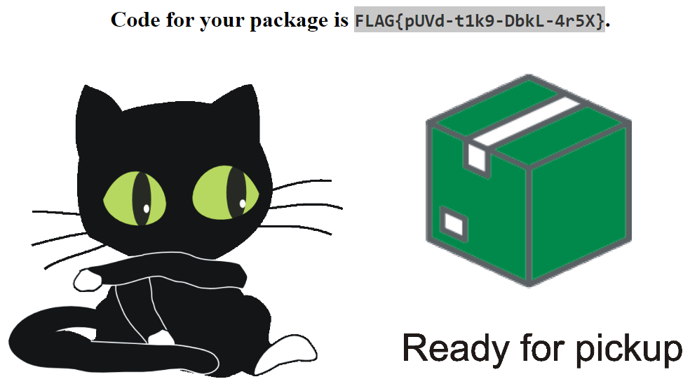

# Old webpages

Hi, packet inspector, the AI has apparently some problems to transfer data from previous information system to new one.
All packages in state "waiting for pickup" were erroneously moved to state "delivered". Now, we have an angry customer
in our depot and she want her package with shipment ID 2022-0845.

In the previous IS, each package had his own domain name (for example, `ID 2022-0845` can be tracked
on http://tracking-2022-0845.mysterious-delivery.thecatch.cz).

Find the pickup code for package `2022-0845` as soon as possible, so we can give it to depot drone.

May the Packet be with you!

---

Very easy challenge (if you know how to lookup archived web pages). I used https://web.archive.org/.

Go to https://web.archive.org/web/20220808090332/http://tracking-2022-0845.mysterious-delivery.thecatch.cz/

