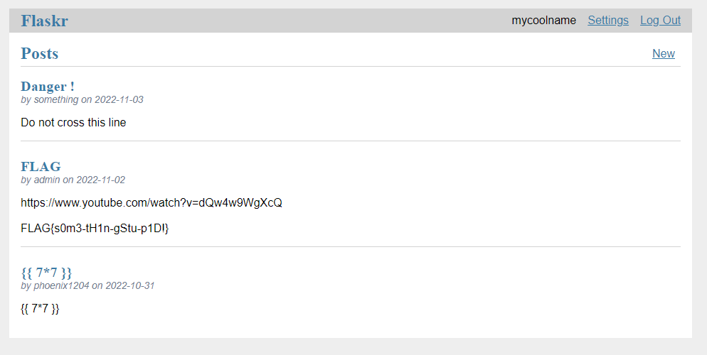
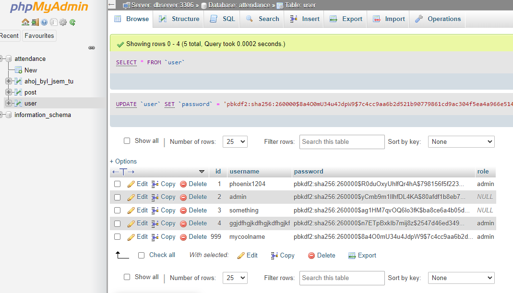
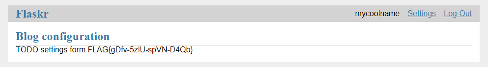

# Blog site

Hi, packet inspector,

a simple blog webpage was created where all employees can write their suggestions for improvements. It is one part of
the optimization plan designed by our allmighty AI.

Examine the web http://blog.mysterious-delivery.tcc:20000/ and find any interesting information.

May the Packet be with you!

---

The blog site (the flag is of course fake):



I started with some automated testing / fuzzing of inputs.

**dirb** brought the fruit:

```
-----------------
DIRB v2.22
By The Dark Raver
-----------------

START_TIME: Fri Oct 28 01:24:34 2022
URL_BASE: http://blog.mysterious-delivery.tcc:20000/
WORDLIST_FILES: /usr/share/dirb/wordlists/common.txt

-----------------

GENERATED WORDS: 4612

---- Scanning URL: http://blog.mysterious-delivery.tcc:20000/ ----
+ http://blog.mysterious-delivery.tcc:20000/.git/HEAD (CODE:200|SIZE:23)
+ http://blog.mysterious-delivery.tcc:20000/create (CODE:302|SIZE:209)
+ http://blog.mysterious-delivery.tcc:20000/hello (CODE:200|SIZE:13)
  ==> DIRECTORY: http://blog.mysterious-delivery.tcc:20000/javascript/
  ==> DIRECTORY: http://blog.mysterious-delivery.tcc:20000/phpmyadmin/
+ http://blog.mysterious-delivery.tcc:20000/server-status (CODE:403|SIZE:296)
+ http://blog.mysterious-delivery.tcc:20000/settings (CODE:302|SIZE:209)

---- Entering directory: http://blog.mysterious-delivery.tcc:20000/javascript/ ----
==> DIRECTORY: http://blog.mysterious-delivery.tcc:20000/javascript/jquery/

---- Entering directory: http://blog.mysterious-delivery.tcc:20000/phpmyadmin/ ----
==> DIRECTORY: http://blog.mysterious-delivery.tcc:20000/phpmyadmin/doc/
+ http://blog.mysterious-delivery.tcc:20000/phpmyadmin/favicon.ico (CODE:200|SIZE:22486)
+ http://blog.mysterious-delivery.tcc:20000/phpmyadmin/index.php (CODE:200|SIZE:16077)
  ==> DIRECTORY: http://blog.mysterious-delivery.tcc:20000/phpmyadmin/js/
+ http://blog.mysterious-delivery.tcc:20000/phpmyadmin/libraries (CODE:403|SIZE:296)
  ==> DIRECTORY: http://blog.mysterious-delivery.tcc:20000/phpmyadmin/locale/
+ http://blog.mysterious-delivery.tcc:20000/phpmyadmin/phpinfo.php (CODE:200|SIZE:16079)
+ http://blog.mysterious-delivery.tcc:20000/phpmyadmin/robots.txt (CODE:200|SIZE:26)
  ==> DIRECTORY: http://blog.mysterious-delivery.tcc:20000/phpmyadmin/sql/
+ http://blog.mysterious-delivery.tcc:20000/phpmyadmin/templates (CODE:403|SIZE:296)
  ==> DIRECTORY: http://blog.mysterious-delivery.tcc:20000/phpmyadmin/themes/

---- Entering directory: http://blog.mysterious-delivery.tcc:20000/javascript/jquery/ ----
+ http://blog.mysterious-delivery.tcc:20000/javascript/jquery/jquery (CODE:200|SIZE:287600)
```

We have a couple of interesting pages

- `/settings` - our ultimate goal
- `/.git/HEAD` - source code even with history of changes
- `/phpmyadmin` - tool for managing the database

I used [git-dumper](https://github.com/arthaud/git-dumper) to download the Git repo.

Browsing through the source code and the history, I found some interesting parts:

```
@bp.route("/settings")
@login_required
def settings():
    """Configure blog"""

    if (not g.user["role"]) or ("admin" not in g.user["role"].split(",")):
        abort(403)

    return render_template("blog/settings.html")
```

We need an **admin** role to get access to settings.

```
cur = get_db().cursor(dictionary=True)
cur.execute("SELECT * FROM user WHERE id = %s", (user_id,))
g.user = cur.fetchone()
```

The role is loaded straight from the database.

So, apparently it'd be the most useful to have access to the database - remember we got `/phpmyadmin`.

Unfortunately, I was unable to log in. I tried lots of things without any luck.
I asked for help, the correct approach is just to randomly combine one of the username
with one of the passwords (found in Git history):

```
attendance / 56843437e5c747a2c9c08e4b79f109c3
```

IMO (and judging based on the total solution of this otherwise rather easy challenge)
this was the least logical step in whole The Catch 2022.

Once we have the access, it's easy. Create a new user with admin role.
First, it's necessary to generate a valid password (password hash). I used
the same approach as the blog itself:

```
from werkzeug.security import generate_password_hash

print(generate_password_hash("qq4QmacKseWV5GPx5gfDAqH5N5tLSYYT"))
```

Prints `pbkdf2:sha256:260000$8a4O0mU34u4JdpW9$7c4cc9aa6b2d521b90779861cd9ac304f5ea4a966e5141416ca80ad182844220`

Insert a new `admin` user:



Log in:



The flag is `FLAG{gDfv-5zlU-spVN-D4Qb}`